# Claude Code 深度技术解析

> 面向想深入理解 Claude Code 内部设计、并基于它进行二次开发的工程师。全文从"为什么这样设计"出发，用大量 Mermaid 图、代码片段和流程细节，把每个模块的设计思路和实现技巧讲透。

---

## 目录

1. [项目全貌与设计哲学](#1-项目全貌与设计哲学)
2. [整体架构分层图](#2-整体架构分层图)
3. [启动链路详解](#3-启动链路详解)
4. [端到端数据流](#4-端到端数据流)
5. [对话引擎核心](#5-对话引擎核心)
6. [Prompt 组装机制](#6-prompt-组装机制)
7. [工具系统：设计、执行与安全](#7-工具系统设计执行与安全)
8. [多 Agent 与 Swarm 协作](#8-多-agent-与-swarm-协作)
9. [上下文压缩策略](#9-上下文压缩策略)
10. [会话持久化与恢复](#10-会话持久化与恢复)
11. [权限体系](#11-权限体系)
12. [扩展系统：Plugin / Skill / Hook](#12-扩展系统plugin--skill--hook)
13. [MCP 集成](#13-mcp-集成)
14. [配置系统](#14-配置系统)
15. [二次开发指南](#15-二次开发指南)
16. [关键文件速查](#16-关键文件速查)

---

## 1. 项目全貌与设计哲学

### 1.1 它是什么

Claude Code 是 Anthropic 官方的**终端 / IDE AI 编程助手**，本质上是一个**可编程的 AI Agent 运行时**。它不只是聊天工具：

```
表面：命令行聊天工具
实质：AI Agent 运行时，支持：
  ├── 读写文件、执行 Shell、搜索代码、访问网络
  ├── 派生子 Agent，多个 AI 并行工作
  ├── 通过 MCP 协议接入外部工具
  ├── 被外部程序通过 JSON API 编程控制
  └── 作为 MCP 服务端，将工具暴露给其他应用
```

### 1.2 三个核心设计原则

理解这三个原则，整个代码库都会变得清晰：

**原则一：安全优先（不是事后补丁，是架构级设计）**

每个工具调用必须经过权限检查。Bash 命令用 Tree-sitter 解析成 AST 做语义分析，文件操作受工作目录边界约束。权限检查与工具执行是同级的基础设施，写在 `toolExecution.ts` 的核心管线里。

**原则二：消息不可变、append-only（为 Prompt Cache 和 Resume 而设计）**

```
❌ 错误做法（会破坏 prompt cache 和 resume）：
   messages[0] = summary_message

✅ 正确做法（append-only）：
   messages = [...messages, boundary_marker, summary_message]
```

原因：Anthropic API 的 prompt cache 基于前缀字节匹配。一旦修改历史，前缀字节变了，cache 失效。append-only 还让会话恢复变成简单的"沿 parentUuid 链回溯"。

**原则三：两套构建分叉（同代码，不同产物）**

同一套源码，通过 `feature()` 开关（Bun 构建期）和 `USER_TYPE === 'ant'` 标志，内部构建和外部发布产生功能差异。外部用户看不到的工具在打包时被 DCE（Dead Code Elimination）掉。

---

## 2. 整体架构分层图

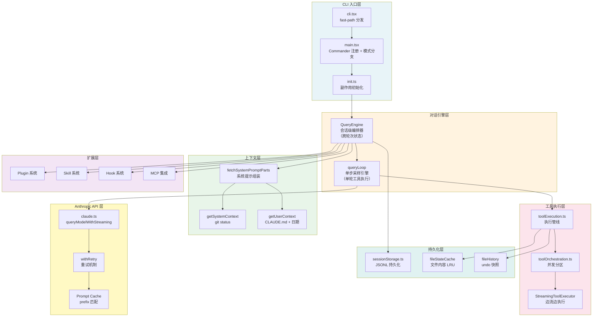
```mermaid
graph TB
    subgraph CLI["CLI 入口层"]
        cli["cli.tsx<br/>fast-path 分发"]
        main["main.tsx<br/>Commander 注册 + 模式分支"]
        init["init.ts<br/>副作用初始化"]
    end

    subgraph Engine["对话引擎层"]
        QE["QueryEngine<br/>会话级编排器<br/>（跨轮次状态）"]
        QL["queryLoop<br/>单步采样引擎<br/>（单轮工具执行）"]
    end

    subgraph Context["上下文层"]
        SC["getSystemContext<br/>git status"]
        UC["getUserContext<br/>CLAUDE.md + 日期"]
        SP["fetchSystemPromptParts<br/>系统提示组装"]
    end

    subgraph Tools["工具执行层"]
        TE["toolExecution.ts<br/>执行管线"]
        TO["toolOrchestration.ts<br/>并发分区"]
        STE["StreamingToolExecutor<br/>边流边执行"]
    end

    subgraph Ext["扩展层"]
        Plugin["Plugin 系统"]
        Skill["Skill 系统"]
        Hook["Hook 系统"]
        MCP["MCP 集成"]
    end

    subgraph Persist["持久化层"]
        SS["sessionStorage.ts<br/>JSONL 持久化"]
        FS["fileStateCache<br/>文件内容 LRU"]
        FH["fileHistory<br/>undo 快照"]
    end

    subgraph API["Anthropic API 层"]
        CM["claude.ts<br/>queryModelWithStreaming"]
        WR["withRetry<br/>重试机制"]
        Cache["Prompt Cache<br/>prefix 匹配"]
    end

    cli --> main --> init --> QE
    QE --> QL
    QE --> SP
    SP --> SC
    SP --> UC
    QL --> TE
    TE --> TO
    TO --> STE
    QL --> CM
    CM --> WR --> Cache
    QE --> Plugin & Skill & Hook & MCP
    QE --> SS
    TE --> FS & FH

    style CLI fill:#e8f4f8
    style Engine fill:#fff3e0
    style Context fill:#e8f5e9
    style Tools fill:#fce4ec
    style Ext fill:#f3e5f5
    style Persist fill:#e0f2f1
    style API fill:#fff9c4
```

### 2.1 关键设计选型

| 选型 | 为什么 |
|------|--------|
| **React + Ink（TUI）** | 终端界面需要状态驱动重绘、组件复用、差量更新。手写 ANSI 字符串管理流式文本+权限弹窗+多面板，维护成本极高 |
| **Bun 运行时** | `bun:bundle` 的 `feature()` 函数实现构建期特性开关（DCE），更快启动速度 |
| **append-only 消息** | prompt cache 精确命中、会话 resume 简单可靠、React 变更检测高效 |
| **三态权限（ask/allow/deny）** | 二态无法表达"这次问用户，下次记住"。`ask` 支持规则持久化和远程审批 |
| **依赖注入（deps.ts）** | `queryLoop` 依赖 `callModel`/`autocompact`，通过 deps 注入而不是直接 import，便于测试时 mock |

---

## 3. 启动链路详解

### 3.1 三层启动架构

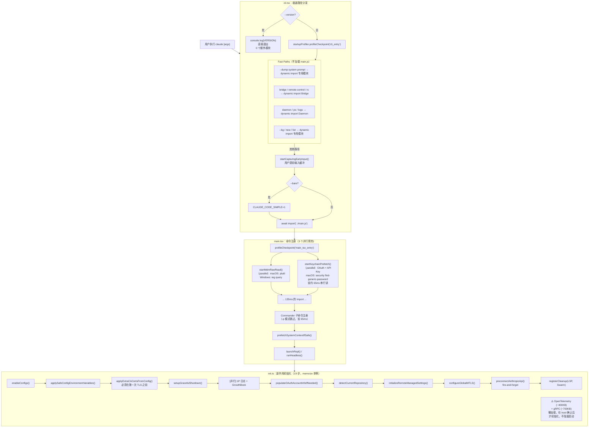
```mermaid
flowchart TD
    CMD["用户执行 claude [args]"] --> CLI

    subgraph CLI["cli.tsx：极速路径分发"]
        V{"--version?"}
        V -->|是| PRINT_V["console.log(VERSION)\n直接退出\n0 个额外模块"]
        V -->|否| PROFILE["startupProfiler.profileCheckpoint('cli_entry')"]
        PROFILE --> FAST_PATHS

        subgraph FAST_PATHS["Fast Paths（不加载 main.js）"]
            FP1["--dump-system-prompt → dynamic import 专用模块"]
            FP2["bridge / remote-control / rc → dynamic import Bridge"]
            FP3["daemon / ps / logs → dynamic import Daemon"]
            FP4["--bg / new / list → dynamic import 专用模块"]
        end

        FAST_PATHS -->|"其他路径"| EARLY["startCapturingEarlyInput()\n用户提前输入缓冲"]
        EARLY --> BARE{"--bare?"}
        BARE -->|是| ENV1["CLAUDE_CODE_SIMPLE=1"]
        ENV1 --> MAIN_IMPORT["await import('../main.js')"]
        BARE -->|否| MAIN_IMPORT
    end

    subgraph MAIN["main.tsx：命令注册（3 个并行预热）"]
        M1["profileCheckpoint('main_tsx_entry')"]
        M2["startMdmRawRead()\n（parallel）macOS: plutil\nWindows: reg query"]
        M3["startKeychainPrefetch()\n（parallel）OAuth + API Key\nmacOS: security find-generic-password\n省约 65ms 串行读"]
        M4["... 135ms 的 import ..."]
        M5["Commander 子命令注册\n（-p 模式跳过，省 65ms）"]
        M6["prefetchSystemContextIfSafe()"]
        M7["launchRepl() / runHeadless()"]

        M1 --> M2
        M1 --> M3
        M2 & M3 --> M4 --> M5 --> M6 --> M7
    end

    subgraph INIT["init.ts：副作用初始化（19 步，memoize 单例）"]
        I1["enableConfigs()"]
        I2["applySafeConfigEnvironmentVariables()"]
        I3["applyExtraCACertsFromConfig()\n必须在第一次 TLS 之前"]
        I4["setupGracefulShutdown()"]
        I5["[并行] 1P 日志 + GrowthBook"]
        I6["populateOAuthAccountInfoIfNeeded()"]
        I7["detectCurrentRepository()"]
        I8["initializeRemoteManagedSettings()"]
        I9["configureGlobalMTLS()"]
        I10["preconnectAnthropicApi()\nfire-and-forget"]
        I11["registerCleanup(LSP, Swarm)"]
        NOTE["⚠️ OpenTelemetry (~400KB)\n+ gRPC (~700KB)\n懒加载，在 trust 确认后\n才初始化，不阻塞启动"]

        I1 --> I2 --> I3 --> I4 --> I5 --> I6 --> I7 --> I8 --> I9 --> I10 --> I11
    end

    MAIN_IMPORT --> MAIN
    M7 --> INIT
```

### 3.2 启动性能优化汇总


```mermaid
gantt
    title Startup Timeline (ms)
    dateFormat x
    axisFormat %Lms

    section cli.tsx
    fast-path check       : 0, 5
    MDM raw read (async)  : 5, 70
    Keychain prefetch (async) : 5, 70

    section main.tsx imports
    Module loading 135ms  : 5, 140

    section Command Register
    Commander setup       : 140, 205

    section init.ts
    CA certs + proxy + preconnect : 205, 240

    section First Render
    Ink render            : 240, 260
```

**Early Input Capture 的作用**：
```
问题：用户常在 claude 命令执行后立刻打字
      如果等 Ink 就绪才开始监听，135ms 内的按键丢失

解决：在 await import('../main.js') 之前调用
      startCapturingEarlyInput()
      用 stdin raw mode 缓冲按键
      Ink 就绪后 consumeEarlyInput() 合并进输入框
```

---

## 4. 端到端数据流

### 4.1 完整数据流（最重要的主线）

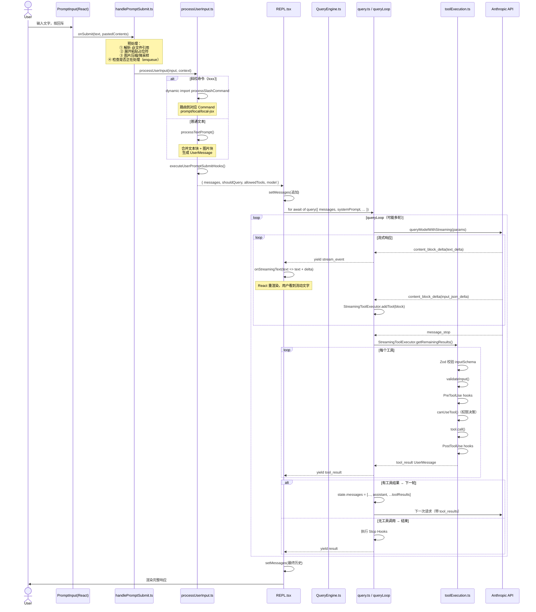
```mermaid
sequenceDiagram
    actor User
    participant PromptInput as PromptInput(React)
    participant HPS as handlePromptSubmit.ts
    participant PUI as processUserInput.ts
    participant REPL as REPL.tsx
    participant QE as QueryEngine.ts
    participant Q as query.ts / queryLoop
    participant TE as toolExecution.ts
    participant API as Anthropic API

    User->>PromptInput: 输入文字，按回车
    PromptInput->>HPS: onSubmit(text, pastedContents)

    Note over HPS: 预处理：<br/>① 解析 @文件引用<br/>② 展开粘贴占位符<br/>③ 图片压缩/降采样<br/>④ 检查是否正在处理（enqueue）

    HPS->>PUI: processUserInput(input, context)

    alt 斜杠命令（/xxx）
        PUI->>PUI: dynamic import processSlashCommand
        Note over PUI: 路由到对应 Command<br/>prompt/local/local-jsx
    else 普通文本
        PUI->>PUI: processTextPrompt()
        Note over PUI: 合并文本块 + 图片块<br/>生成 UserMessage
    end

    PUI->>PUI: executeUserPromptSubmitHooks()
    PUI-->>REPL: { messages, shouldQuery, allowedTools, model }

    REPL->>REPL: setMessages(追加)
    REPL->>Q: for await of query({ messages, systemPrompt, ... })

    loop queryLoop（可能多轮）
        Q->>API: queryModelWithStreaming(params)

        loop 流式响应
            API-->>Q: content_block_delta(text_delta)
            Q-->>REPL: yield stream_event
            REPL->>REPL: onStreamingText(text => text + delta)
            Note over REPL: React 重渲染，用户看到流动文字

            API-->>Q: content_block_delta(input_json_delta)
            Q->>Q: StreamingToolExecutor.addTool(block)
        end

        API-->>Q: message_stop
        Q->>TE: StreamingToolExecutor.getRemainingResults()

        loop 每个工具
            TE->>TE: Zod 校验 inputSchema
            TE->>TE: validateInput()
            TE->>TE: PreToolUse hooks
            TE->>TE: canUseTool()（权限决策）
            TE->>TE: tool.call()
            TE->>TE: PostToolUse hooks
            TE-->>Q: tool_result UserMessage
            Q-->>REPL: yield tool_result
        end

        alt 有工具结果 → 下一轮
            Q->>Q: state.messages = [..., assistant, ...toolResults]
            Q->>API: 下一次请求（带 tool_results）
        else 无工具调用 → 结束
            Q->>Q: 执行 Stop Hooks
            Q-->>REPL: yield result
        end
    end

    REPL->>REPL: setMessages(最终历史)
    REPL->>User: 渲染完整响应
```

### 4.2 斜杠命令的路由细节

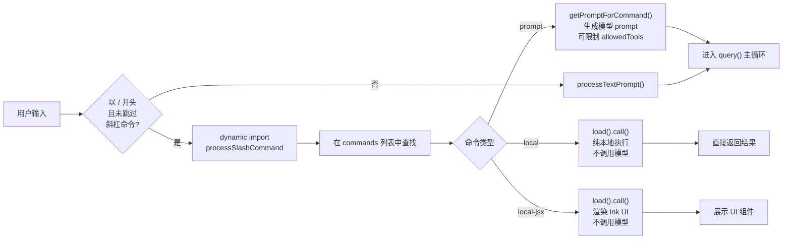
```mermaid
flowchart LR
    INPUT["用户输入"] --> SLASH{"以 / 开头\n且未跳过\n斜杠命令?"}

    SLASH -->|是| LOAD["dynamic import\nprocessSlashCommand"]
    SLASH -->|否| TEXT["processTextPrompt()"]

    LOAD --> FIND["在 commands 列表中查找"]
    FIND --> TYPE{"命令类型"}

    TYPE -->|"prompt"| PROMPT["getPromptForCommand()\n生成模型 prompt\n可限制 allowedTools"]
    TYPE -->|"local"| LOCAL["load().call()\n纯本地执行\n不调用模型"]
    TYPE -->|"local-jsx"| JSX["load().call()\n渲染 Ink UI\n不调用模型"]

    PROMPT --> QUERY["进入 query() 主循环"]
    LOCAL --> RESULT["直接返回结果"]
    JSX --> UI["展示 UI 组件"]

    TEXT --> QUERY
```

**有趣的优化**：如果当前正在处理中，但命令是 `immediate && local-jsx`，REPL 会直接加载命令弹出 UI，而不走完整的 `processUserInput` 流程。这让权限对话框可以在模型思考时被打开。

### 4.3 图片/多模态处理流

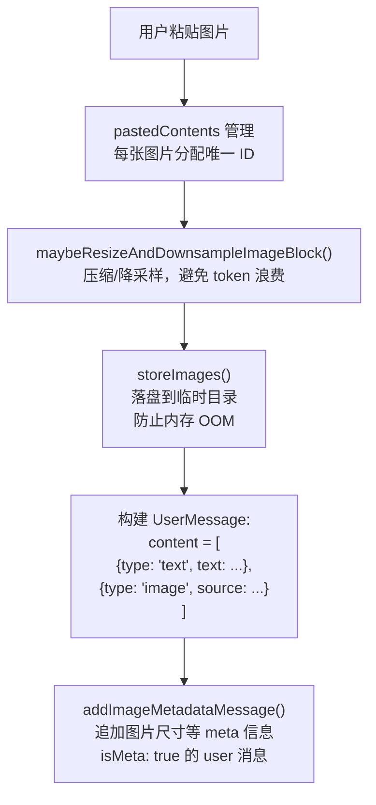
```mermaid
flowchart TD
    PASTE["用户粘贴图片"] --> STORE["pastedContents 管理\n每张图片分配唯一 ID"]
    STORE --> RESIZE["maybeResizeAndDownsampleImageBlock()\n压缩/降采样，避免 token 浪费"]
    RESIZE --> DISK["storeImages()\n落盘到临时目录\n防止内存 OOM"]
    DISK --> MSG["构建 UserMessage:\ncontent = [\n  {type: 'text', text: ...},\n  {type: 'image', source: ...}\n]"]
    MSG --> META["addImageMetadataMessage()\n追加图片尺寸等 meta 信息\nisMeta: true 的 user 消息"]
```

### 4.4 API 流式响应的状态机

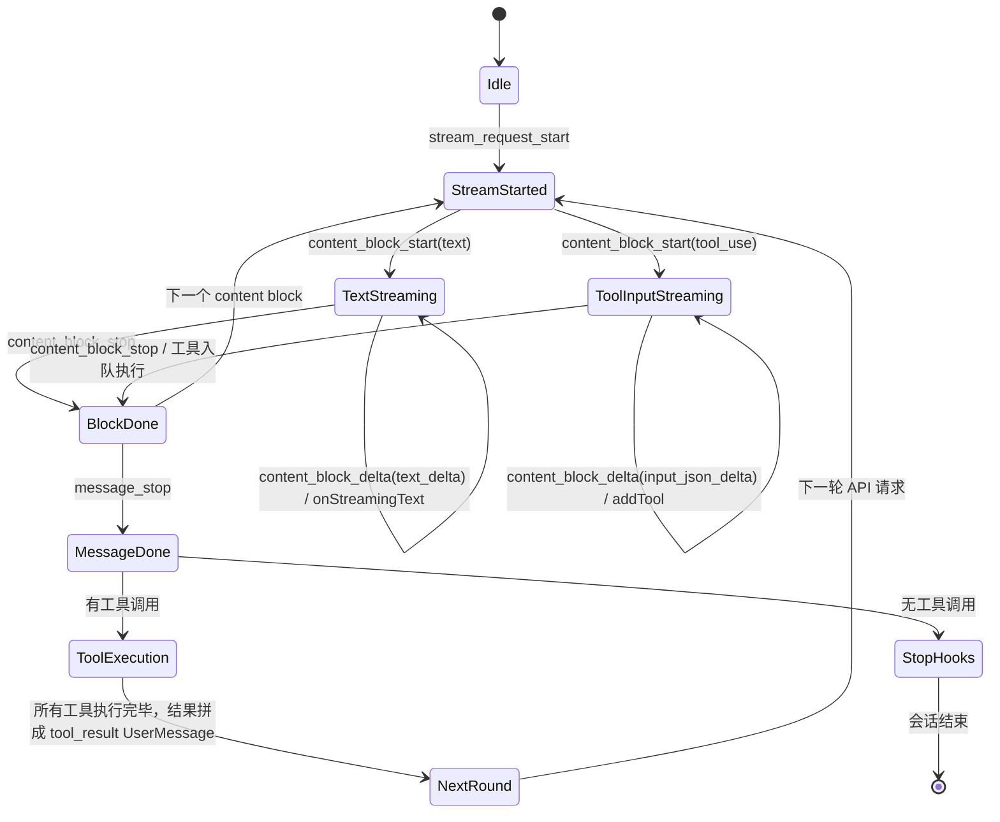
```mermaid
stateDiagram-v2
    [*] --> Idle

    Idle --> StreamStarted: stream_request_start

    StreamStarted --> TextStreaming: content_block_start(text)
    TextStreaming --> TextStreaming: content_block_delta(text_delta) / onStreamingText
    TextStreaming --> BlockDone: content_block_stop

    StreamStarted --> ToolInputStreaming: content_block_start(tool_use)
    ToolInputStreaming --> ToolInputStreaming: content_block_delta(input_json_delta) / addTool
    ToolInputStreaming --> BlockDone: content_block_stop / 工具入队执行

    BlockDone --> StreamStarted: 下一个 content block
    BlockDone --> MessageDone: message_stop

    MessageDone --> ToolExecution: 有工具调用
    MessageDone --> StopHooks: 无工具调用

    ToolExecution --> NextRound: 所有工具执行完毕，结果拼成 tool_result UserMessage
    NextRound --> StreamStarted: 下一轮 API 请求

    StopHooks --> [*]: 会话结束
```

---

## 5. 对话引擎核心

### 5.1 QueryEngine vs queryLoop 的职责分离


```mermaid
graph LR
    subgraph QE["QueryEngine（会话级编排器）"]
        QE1["跨轮次状态维护"]
        QE2["权限上下文（canUseTool）"]
        QE3["模型选择（getMainLoopModel）"]
        QE4["MCP 连接管理"]
        QE5["文件缓存（fileStateCache）\n跨轮复用"]
        QE6["会话 transcript 写入"]
        QE7["成本/token 累计追踪"]
        QE8["插件/技能加载"]
    end

    subgraph QL["queryLoop（单步采样引擎）"]
        QL1["上下文压缩决策"]
        QL2["模型采样（callModel）"]
        QL3["流式工具执行"]
        QL4["Token 预算检查"]
        QL5["Stop Hooks 触发"]
        QL6["错误重试/恢复"]
    end

    QE -->|"每次 submitMessage 调用 query"| QL
    QL -->|"yield SDKMessage 流式事件"| QE
```

**一句话区别**：`QueryEngine` 管"整个会话"；`queryLoop` 管"一次模型采样到下次采样"。

### 5.2 queryLoop 详细流程

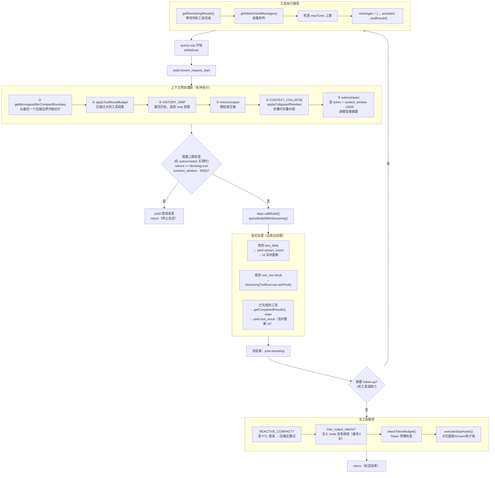
```mermaid
flowchart TD
    START["queryLoop 开始\nwhile(true)"] --> YIELD_START["yield stream_request_start"]

    YIELD_START --> PRE["上下文预处理链"]

    subgraph PRE["上下文预处理链（有序执行）"]
        P1["① getMessagesAfterCompactBoundary\n从最后一个压缩边界开始切片"]
        P2["② applyToolResultBudget\n压缩过大的工具结果"]
        P3["③ HISTORY_SNIP\n裁剪历史，投影 snip 视图"]
        P4["④ microcompact\n细粒度压缩"]
        P5["⑤ CONTEXT_COLLAPSE\napplyCollapsesIfNeeded\n折叠可折叠内容"]
        P6["⑥ autocompact\n若 token > context_window - 13000\n调模型做摘要"]
        P1 --> P2 --> P3 --> P4 --> P5 --> P6
    end

    PRE --> CHECK_BLOCK{"阻塞上限检查\n(仅 autocompact 关闭时)\ntokens >= blockingLimit\n(context_window - 3000)?"}
    CHECK_BLOCK -->|是| YIELD_ERR["yield 错误消息\nreturn（终止会话）"]
    CHECK_BLOCK -->|否| CALL_MODEL["deps.callModel()\nqueryModelWithStreaming()"]

    CALL_MODEL --> STREAM["流式处理响应"]

    subgraph STREAM["流式处理（边收边处理）"]
        S1["收到 text_delta\n→ yield stream_event\n→ UI 实时更新"]
        S2["收到 tool_use block\n→ StreamingToolExecutor.addTool()"]
        S3["已完成的工具\n→ getCompletedResults() drain\n→ yield tool_result（及时更新 UI）"]
    end

    STREAM --> POST["流结束，post-sampling"]

    POST --> NEED_FOLLOWUP{"需要 follow-up?\n(有工具调用?)"}

    NEED_FOLLOWUP -->|否| NO_TOOL_PATH["无工具路径"]
    subgraph NO_TOOL_PATH["无工具路径"]
        N1["REACTIVE_COMPACT?\n若 PTL 错误 → 压缩后重试"]
        N2["max_output_tokens?\n注入 meta 消息继续（最多3次）"]
        N3["checkTokenBudget()\nToken 预算检查"]
        N4["executeStopHooks()\n记忆提取/Dream/钩子链"]
        N1 --> N2 --> N3 --> N4
    end
    NO_TOOL_PATH --> DONE["return（会话结束）"]

    NEED_FOLLOWUP -->|是| TOOL_PATH["工具执行路径"]
    subgraph TOOL_PATH["工具执行路径"]
        T1["getRemainingResults()\n等待所有工具完成"]
        T2["getAttachmentMessages()\n收集附件"]
        T3["检查 maxTurns 上限"]
        T4["messages = [..., assistant, ...toolResults]"]
        T1 --> T2 --> T3 --> T4
    end
    TOOL_PATH --> START
```

### 5.3 Token 预算的"收益递减"算法

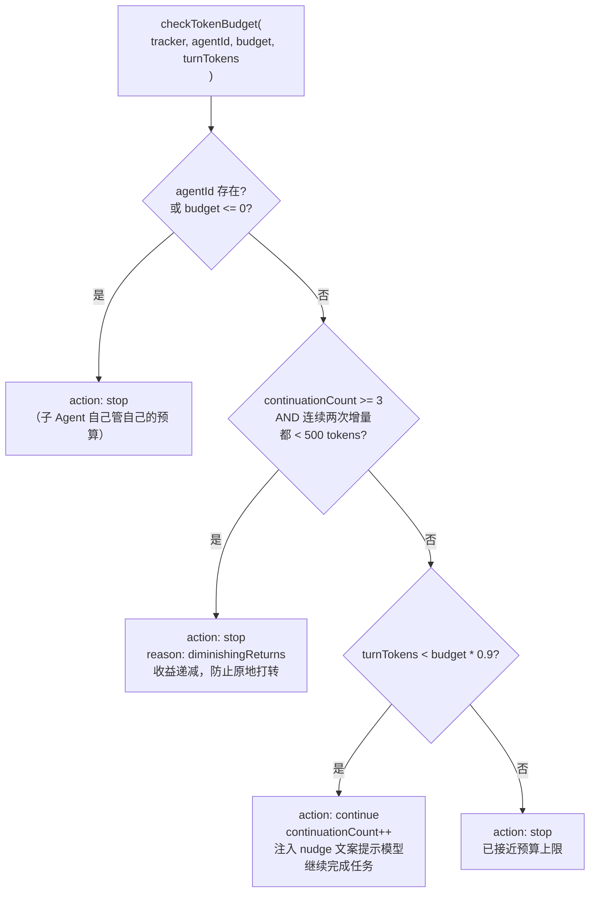
```mermaid
flowchart TD
    IN["checkTokenBudget(\n  tracker, agentId, budget, turnTokens\n)"]

    IN --> C1{"agentId 存在?\n或 budget <= 0?"}
    C1 -->|是| STOP1["action: stop\n（子 Agent 自己管自己的预算）"]

    C1 -->|否| C2{"continuationCount >= 3\nAND 连续两次增量\n都 < 500 tokens?"}
    C2 -->|是| STOP2["action: stop\nreason: diminishingReturns\n收益递减，防止原地打转"]

    C2 -->|否| C3{"turnTokens < budget * 0.9?"}
    C3 -->|是| CONTINUE["action: continue\ncontinuationCount++\n注入 nudge 文案提示模型\n继续完成任务"]

    C3 -->|否| STOP3["action: stop\n已接近预算上限"]
```

**设计意图**：如果 Agent 在消耗 token 但每轮新增不超过 500 个（持续 3 轮），说明它在"原地打转"，主动终止比继续浪费钱更好。

### 5.4 依赖注入（deps.ts）的设计意图

```typescript
// src/query/deps.ts
type QueryDeps = {
  callModel:    typeof queryModelWithStreaming  // 可被测试替换
  microcompact: typeof microcompactMessages    // 可被测试替换
  autocompact:  typeof autoCompactIfNeeded     // 可被测试替换
  uuid:         () => string                   // 可被测试替换
}

// 生产路径
const productionDeps = (): QueryDeps => ({
  callModel: queryModelWithStreaming,
  ...
})

// query() 的调用方式
query({ ..., deps: myMockDeps ?? productionDeps() })

// 测试中：
query({ ..., deps: {
  callModel: async (params) => mockStream,  // 无需 HTTP
  autocompact: () => { /* no-op */ },
  ...
}})
```

**为什么这样做**：注释说，用 `spyOn` 跨模块 mock 在多个测试文件里重复很烦。deps 注入让 `queryLoop` 的核心逻辑与 HTTP 调用完全解耦，可以轻松做单元测试。

---

## 6. Prompt 组装机制

### 6.1 Prompt 的三层结构

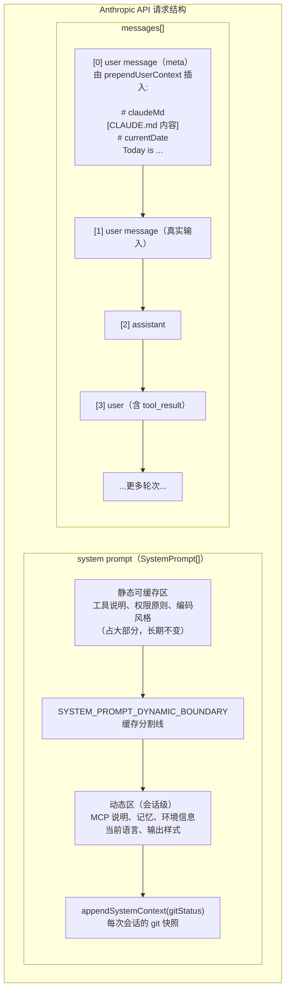
```mermaid
graph TB
    subgraph API_Request["Anthropic API 请求结构"]
        subgraph SYS["system prompt（SystemPrompt[]）"]
            S1["静态可缓存区\n工具说明、权限原则、编码风格\n（占大部分，长期不变）"]
            S2["SYSTEM_PROMPT_DYNAMIC_BOUNDARY\n缓存分割线"]
            S3["动态区（会话级）\nMCP 说明、记忆、环境信息\n当前语言、输出样式"]
            S4["appendSystemContext(gitStatus)\n每次会话的 git 快照"]
        end

        subgraph MSGS["messages[]"]
            M1["[0] user message（meta）\n由 prependUserContext 插入:\n<system-reminder>\n# claudeMd\n[CLAUDE.md 内容]\n# currentDate\nToday is ...\n</system-reminder>"]
            M2["[1] user message（真实输入）"]
            M3["[2] assistant"]
            M4["[3] user（含 tool_result）"]
            M5["...更多轮次..."]
        end
    end

    S1 --> S2 --> S3 --> S4
    M1 --> M2 --> M3 --> M4 --> M5
```

**关键设计问题：为什么 CLAUDE.md 放在 user 消息里而不是 system prompt？**

```
system prompt 用于"静态工具说明"（高度可缓存）
CLAUDE.md 随项目变化（较难缓存）

分开放置，最大化 prompt cache 命中率：
- 工具说明改变 → 只有 system prompt 的缓存失效
- CLAUDE.md 改变 → 只有 user 层缓存失效
- 二者独立变化，互不影响
```

### 6.2 CLAUDE.md 加载路径

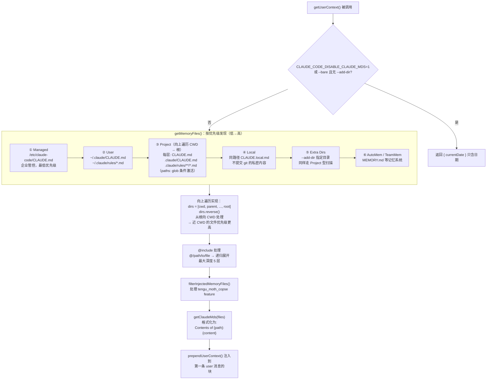
```mermaid
flowchart TB
    TRIGGER["getUserContext() 被调用"] --> CHECK_DISABLE{"CLAUDE_CODE_DISABLE_CLAUDE_MDS=1\n或 --bare 且无 --add-dir?"}
    CHECK_DISABLE -->|是| SKIP["返回 { currentDate } 只含日期"]
    CHECK_DISABLE -->|否| LOAD_STEP

    subgraph LOAD_STEP["getMemoryFiles()：按优先级发现（低→高）"]
        L1["① Managed\n/etc/claude-code/CLAUDE.md\n企业管控，最低优先级"]
        L2["② User\n~/.claude/CLAUDE.md\n~/.claude/rules/*.md"]
        L3["③ Project（向上遍历 CWD → 根）\n每层: CLAUDE.md\n       .claude/CLAUDE.md\n       .claude/rules/**/*.md\n（paths: glob 条件激活）"]
        L4["④ Local\n同路径 CLAUDE.local.md\n不提交 git 的私密内容"]
        L5["⑤ Extra Dirs\n--add-dir 指定目录\n同样走 Project 型扫描"]
        L6["⑥ AutoMem / TeamMem\nMEMORY.md 等记忆系统"]
        L1 --> L2 --> L3 --> L4 --> L5 --> L6
    end

    LOAD_STEP --> TRAVERSE["向上遍历实现：\ndirs = [cwd, parent, ..., root]\ndirs.reverse()\n从根向 CWD 处理\n→ 近 CWD 的文件优先级更高"]

    TRAVERSE --> INCLUDE["@include 处理\n@/path/to/file → 递归展开\n最大深度 5 层"]

    INCLUDE --> FILTER["filterInjectedMemoryFiles()\n处理 tengu_moth_copse feature"]

    FILTER --> FORMAT["getClaudeMds(files)\n格式化为:\nContents of {path}:\n{content}"]

    FORMAT --> INJECT["prependUserContext() 注入到\n第一条 user 消息的\n<system-reminder> 块"]
```

### 6.3 System Prompt 的章节结构

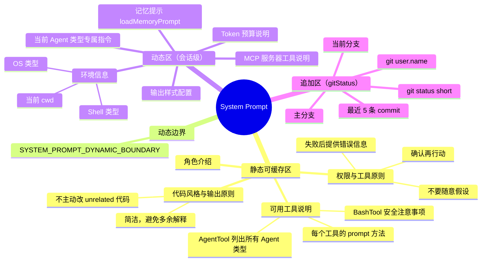
```mermaid
mindmap
  root((System Prompt))
    静态可缓存区
      角色介绍
      权限与工具原则
        不要随意假设
        确认再行动
        失败后提供错误信息
      可用工具说明
        每个工具的 prompt 方法
        AgentTool 列出所有 Agent 类型
        BashTool 安全注意事项
      代码风格与输出原则
        简洁，避免多余解释
        不主动改 unrelated 代码
    动态边界
      SYSTEM_PROMPT_DYNAMIC_BOUNDARY
    动态区（会话级）
      MCP 服务器工具说明
      记忆提示 loadMemoryPrompt
      环境信息
        OS 类型
        当前 cwd
        Shell 类型
      输出样式配置
      Token 预算说明
      当前 Agent 类型专属指令
    追加区（gitStatus）
      当前分支
      主分支
      git status short
      最近 5 条 commit
      git user.name
```

---

## 7. 工具系统：设计、执行与安全

### 7.1 Tool 接口设计

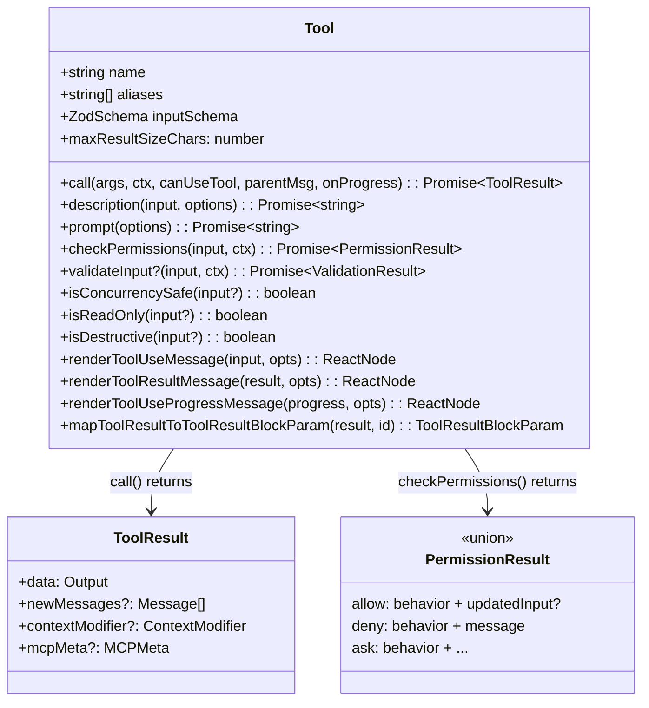
```mermaid
classDiagram
    class Tool {
        +string name
        +string[] aliases
        +ZodSchema inputSchema
        +call(args, ctx, canUseTool, parentMsg, onProgress): Promise~ToolResult~
        +description(input, options): Promise~string~
        +prompt(options): Promise~string~
        +checkPermissions(input, ctx): Promise~PermissionResult~
        +validateInput?(input, ctx): Promise~ValidationResult~
        +isConcurrencySafe(input?): boolean
        +isReadOnly(input?): boolean
        +isDestructive(input?): boolean
        +renderToolUseMessage(input, opts): ReactNode
        +renderToolResultMessage(result, opts): ReactNode
        +renderToolUseProgressMessage(progress, opts): ReactNode
        +mapToolResultToToolResultBlockParam(result, id): ToolResultBlockParam
        +maxResultSizeChars: number
    }

    class ToolResult {
        +data: Output
        +newMessages?: Message[]
        +contextModifier?: ContextModifier
        +mcpMeta?: MCPMeta
    }

    class PermissionResult {
        <<union>>
        allow: behavior + updatedInput?
        deny: behavior + message
        ask: behavior + ...
    }

    Tool --> ToolResult : call() returns
    Tool --> PermissionResult : checkPermissions() returns
```

**`description()` vs `prompt()` 的区别**：
- `description(input)` → 每次工具调用时的**简短描述**（用于 ToolSearch 和 UI 展示）
- `prompt(options)` → 发给模型的**完整工具说明文本**（注入 system prompt，含用法、限制、示例）

### 7.2 工具执行的完整管线

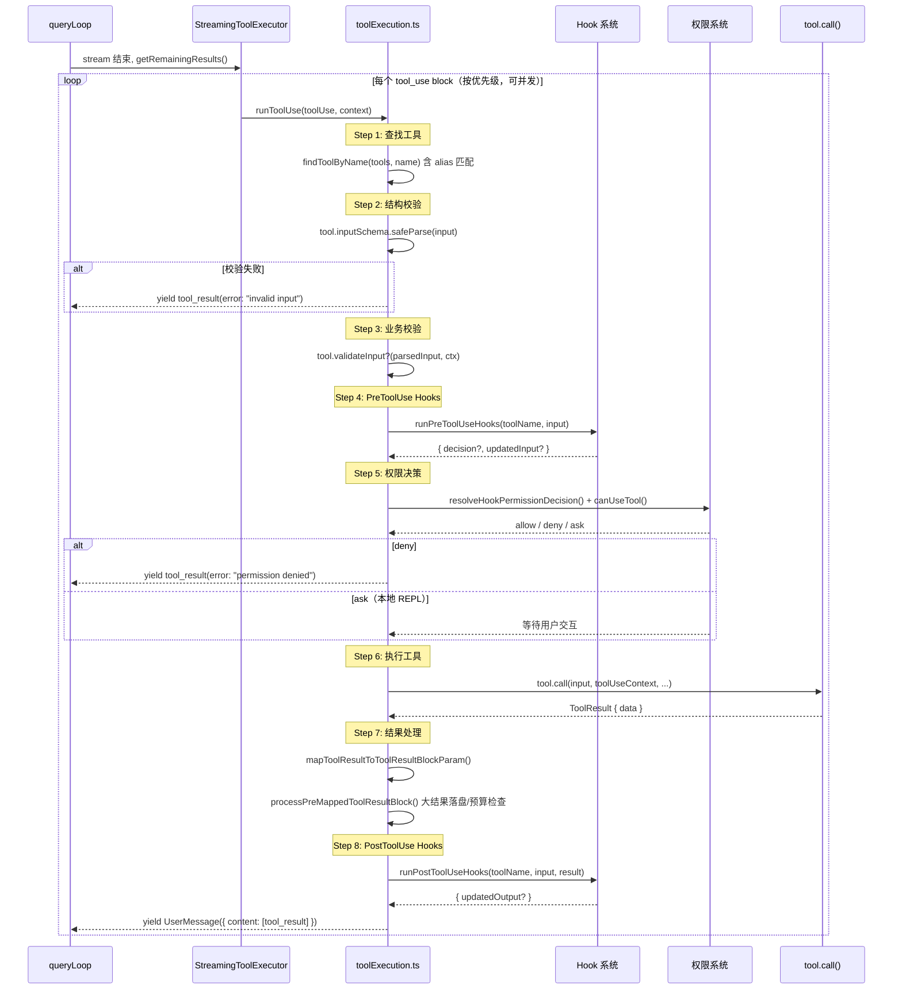
```mermaid
sequenceDiagram
    participant Q as queryLoop
    participant STE as StreamingToolExecutor
    participant TE as toolExecution.ts
    participant Hook as Hook 系统
    participant Perm as 权限系统
    participant Tool as tool.call()

    Q->>STE: stream 结束, getRemainingResults()

    loop 每个 tool_use block（按优先级，可并发）
        STE->>TE: runToolUse(toolUse, context)

        Note over TE: Step 1: 查找工具
        TE->>TE: findToolByName(tools, name) 含 alias 匹配

        Note over TE: Step 2: 结构校验
        TE->>TE: tool.inputSchema.safeParse(input)
        alt 校验失败
            TE-->>Q: yield tool_result(error: "invalid input")
        end

        Note over TE: Step 3: 业务校验
        TE->>TE: tool.validateInput?(parsedInput, ctx)

        Note over TE: Step 4: PreToolUse Hooks
        TE->>Hook: runPreToolUseHooks(toolName, input)
        Hook-->>TE: { decision?, updatedInput? }

        Note over TE: Step 5: 权限决策
        TE->>Perm: resolveHookPermissionDecision() + canUseTool()
        Perm-->>TE: allow / deny / ask

        alt deny
            TE-->>Q: yield tool_result(error: "permission denied")
        else ask（本地 REPL）
            Perm-->>TE: 等待用户交互
        end

        Note over TE: Step 6: 执行工具
        TE->>Tool: tool.call(input, toolUseContext, ...)
        Tool-->>TE: ToolResult { data }

        Note over TE: Step 7: 结果处理
        TE->>TE: mapToolResultToToolResultBlockParam()
        TE->>TE: processPreMappedToolResultBlock() 大结果落盘/预算检查

        Note over TE: Step 8: PostToolUse Hooks
        TE->>Hook: runPostToolUseHooks(toolName, input, result)
        Hook-->>TE: { updatedOutput? }

        TE-->>Q: yield UserMessage({ content: [tool_result] })
    end
```

### 7.3 并发工具执行策略

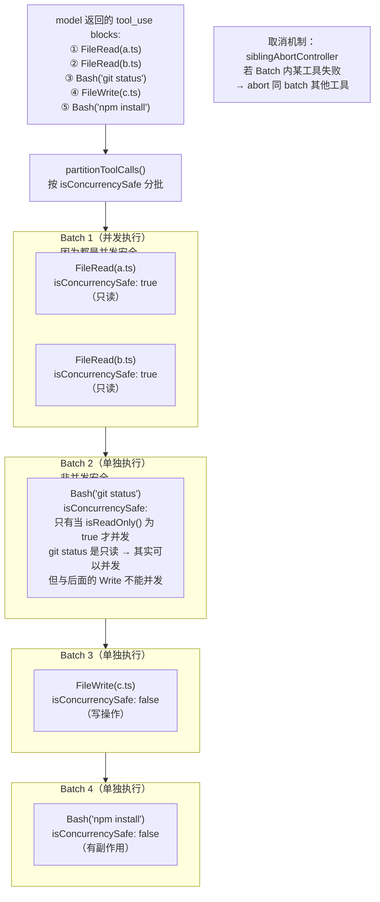
```mermaid
flowchart TD
    TOOLS["model 返回的 tool_use blocks:\n① FileRead(a.ts)\n② FileRead(b.ts)\n③ Bash('git status')\n④ FileWrite(c.ts)\n⑤ Bash('npm install')"] --> PARTITION["partitionToolCalls()\n按 isConcurrencySafe 分批"]

    subgraph BATCH1["Batch 1（并发执行）\n因为都是并发安全"]
        B1A["FileRead(a.ts)\nisConcurrencySafe: true\n（只读）"]
        B1B["FileRead(b.ts)\nisConcurrencySafe: true\n（只读）"]
    end

    subgraph BATCH2["Batch 2（单独执行）\n非并发安全"]
        B2["Bash('git status')\nisConcurrencySafe:\n只有当 isReadOnly() 为 true 才并发\ngit status 是只读 → 其实可以并发\n但与后面的 Write 不能并发"]
    end

    subgraph BATCH3["Batch 3（单独执行）"]
        B3["FileWrite(c.ts)\nisConcurrencySafe: false\n（写操作）"]
    end

    subgraph BATCH4["Batch 4（单独执行）"]
        B4["Bash('npm install')\nisConcurrencySafe: false\n（有副作用）"]
    end

    PARTITION --> BATCH1 --> BATCH2 --> BATCH3 --> BATCH4

    NOTE["取消机制：siblingAbortController\n若 Batch 内某工具失败\n→ abort 同 batch 其他工具"]
```

### 7.4 BashTool 安全决策树（完整版）

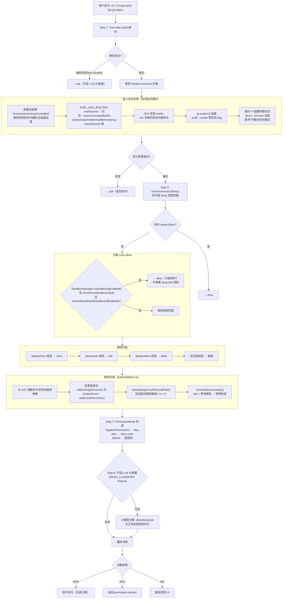
```mermaid
flowchart TD
    CMD["用户命令: rm -rf /tmp/cache && git status"]

    CMD --> TREE_SITTER["Step 1: Tree-sitter bash 解析"]

    TREE_SITTER --> AST_OK{"解析成功?"}
    AST_OK -->|解析失败/too-complex| ASK1["→ ask（可走 LLM 分类器）"]
    AST_OK -->|成功| CMDS["得到 SimpleCommand 列表"]

    CMDS --> SEMANTICS["Step 2: checkSemantics() 语义安全检查"]

    subgraph SEMANTICS["语义安全检查（检测危险模式）"]
        SE1["剥离包装器: timeout/nice/nohup/env/stdbuf\n避免把危险命令藏在包装器后面"]
        SE2["EVAL_LIKE_BUILTINS:\neval/source/.（点号）/exec/command/builtin\ncoproc/trap/enable/mapfile/readarray\nhash/alias/let 等"]
        SE3["ZSH 危险 builtin:\nzsh 专属的危险内置命令"]
        SE4["jq system() 函数\njq 的 --rawfile 等危险 flag"]
        SE5["换行+# 隐藏参数攻击\n/proc/.../environ 读取\n算术/子脚本危险模式"]
        SE1 --> SE2 --> SE3 --> SE4 --> SE5
    end

    SEMANTICS --> SEM_OK{"语义检查通过?"}
    SEM_OK -->|失败| ASK2["→ ask（危险命令）"]
    SEM_OK -->|通过| DENY_RULES["Step 3: checkSemanticsDeny()\n命令级 Deny 规则匹配"]

    DENY_RULES --> DENY_OK{"命中 alwaysDeny?"}
    DENY_OK -->|是| DENY["→ deny"]
    DENY_OK -->|否| SANDBOX["Step 4: 沙箱 Auto-allow 检查"]

    subgraph SANDBOX["沙箱 Auto-allow"]
        SA1{"SandboxManager.isSandboxingEnabled()\n且 shouldUseSandbox(input)\n且 isAutoAllowBashIfSandboxedEnabled()?"}
        SA1 -->|是| AUTO_ALLOW["→ allow（沙箱保护）\n仍尊重 deny/ask 规则"]
        SA1 -->|否| RULE_MATCH["继续规则匹配"]
    end

    SANDBOX --> RULES["Step 5: 规则匹配（gitignore 风格）"]

    subgraph RULES["规则匹配"]
        R1["alwaysDeny 规则 → deny"]
        R2["alwaysAsk 规则 → ask"]
        R3["alwaysAllow 规则 → allow"]
        R4["无匹配规则 → 继续"]
        R1 --> R2 --> R3 --> R4
    end

    RULES --> PATH_CHECK["Step 6: 路径约束检查"]

    subgraph PATH_CHECK["路径约束（pathValidation.ts）"]
        PC1["从 AST 提取命令涉及的路径参数"]
        PC2["检查是否在 allWorkingDirectories 内\n(originalCwd + additionalDirectories)"]
        PC3["checkDangerousRemovalPath()\n检测危险删除路径: rm -rf /"]
        PC4["checkSedConstraints()\nsed -i 原地修改 → 特殊检查"]
        PC1 --> PC2 --> PC3 --> PC4
    end

    PATH_CHECK --> MODE_CHECK["Step 7: PermissionMode 检查\nbypassPermissions → skip\nplan → deny write\ndefault → 按规则"]

    MODE_CHECK --> CLASSIFIER{"Step 8: 可选 LLM 分类器\n(BASH_CLASSIFIER feature)"}
    CLASSIFIER -->|开启| LLM_CLASS["小模型分类: allow/deny/ask\n与正常权限规则并行"]
    CLASSIFIER -->|关闭| FINAL["最终决策"]
    LLM_CLASS --> FINAL

    FINAL --> EXEC{"决策结果"}
    EXEC -->|allow| RUN["执行命令（可选沙箱）"]
    EXEC -->|deny| BLOCKED["返回 permission denied"]
    EXEC -->|ask| UI["触发权限 UI"]
```

### 7.5 FileEditTool 的字符串替换机制

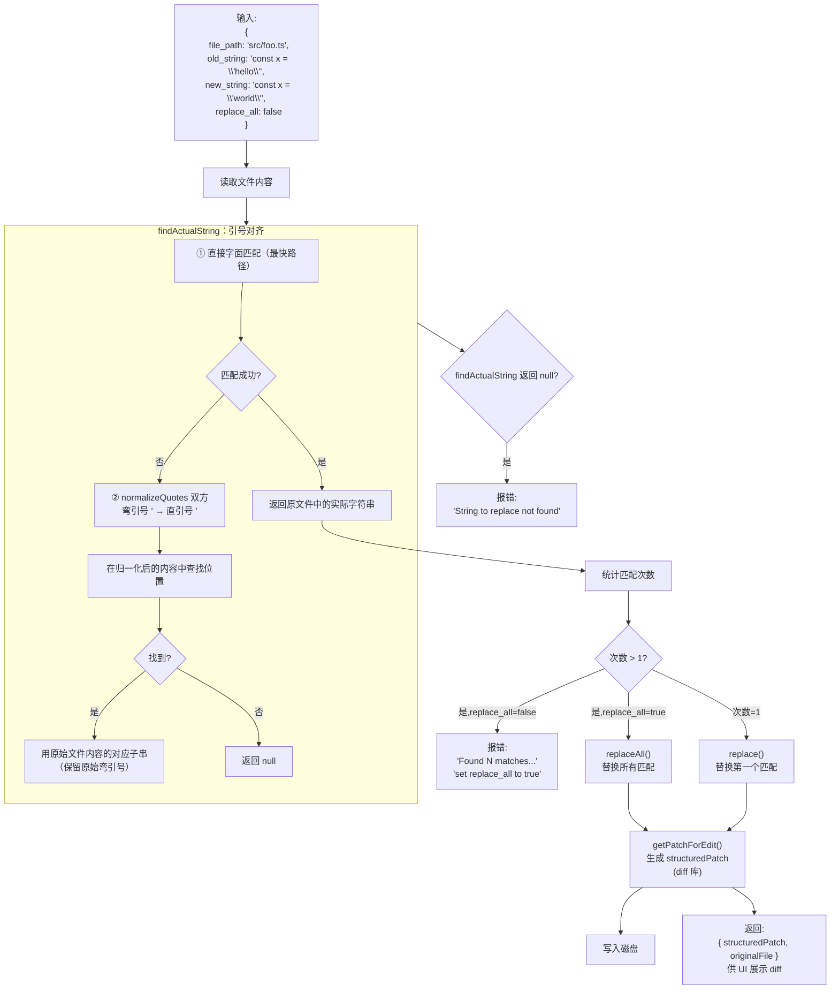
```mermaid
flowchart TD
    INPUT["输入:\n{\n  file_path: 'src/foo.ts',\n  old_string: 'const x = \\'hello\\'',\n  new_string: 'const x = \\'world\\'',\n  replace_all: false\n}"] --> READ["读取文件内容"]

    READ --> FIND_STEP

    subgraph FIND_STEP["findActualString：引号对齐"]
        F1["① 直接字面匹配（最快路径）"]
        F1 --> F2{"匹配成功?"}
        F2 -->|是| FOUND["返回原文件中的实际字符串"]
        F2 -->|否| F3["② normalizeQuotes 双方\n弯引号 ' → 直引号 '"]
        F3 --> F4["在归一化后的内容中查找位置"]
        F4 --> F5{"找到?"}
        F5 -->|是| F6["用原始文件内容的对应子串\n（保留原始弯引号）"]
        F5 -->|否| F7["返回 null"]
    end

    FOUND --> COUNT["统计匹配次数"]

    COUNT --> MULTI{"次数 > 1?"}
    MULTI -->|是,replace_all=false| ERR["报错:\n'Found N matches...'\n'set replace_all to true'"]
    MULTI -->|是,replace_all=true| REPLACE_ALL["replaceAll()\n替换所有匹配"]
    MULTI -->|次数=1| REPLACE_ONE["replace()\n替换第一个匹配"]

    FIND_STEP --> NULL_CASE{"findActualString 返回 null?"}
    NULL_CASE -->|是| ERR2["报错:\n'String to replace not found'"]

    REPLACE_ALL --> PATCH["getPatchForEdit()\n生成 structuredPatch\n(diff 库)"]
    REPLACE_ONE --> PATCH

    PATCH --> WRITE["写入磁盘"]
    PATCH --> RESULT["返回:\n{ structuredPatch, originalFile }\n供 UI 展示 diff"]
```

---

## 8. 多 Agent 与 Swarm 协作

### 8.1 Agent 定义的三种来源与覆盖关系

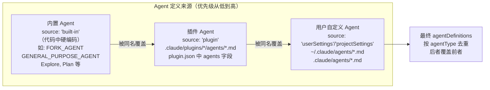
```mermaid
flowchart LR
    subgraph SOURCES["Agent 定义来源（优先级从低到高）"]
        BUILTIN["内置 Agent\nsource: 'built-in'\n（代码中硬编码）\n如: FORK_AGENT\nGENERAL_PURPOSE_AGENT\nExplore, Plan 等"]

        PLUGIN["插件 Agent\nsource: 'plugin'\n.claude/plugins/*/agents/*.md\nplugin.json 中 agents 字段"]

        CUSTOM["用户自定义 Agent\nsource: 'userSettings'/'projectSettings'\n~/.claude/agents/*.md\n.claude/agents/*.md"]
    end

    BUILTIN -->|"被同名覆盖"| PLUGIN
    PLUGIN -->|"被同名覆盖"| CUSTOM

    CUSTOM --> RESULT["最终 agentDefinitions\n按 agentType 去重\n后者覆盖前者"]
```

### 8.2 AgentTool 执行路径

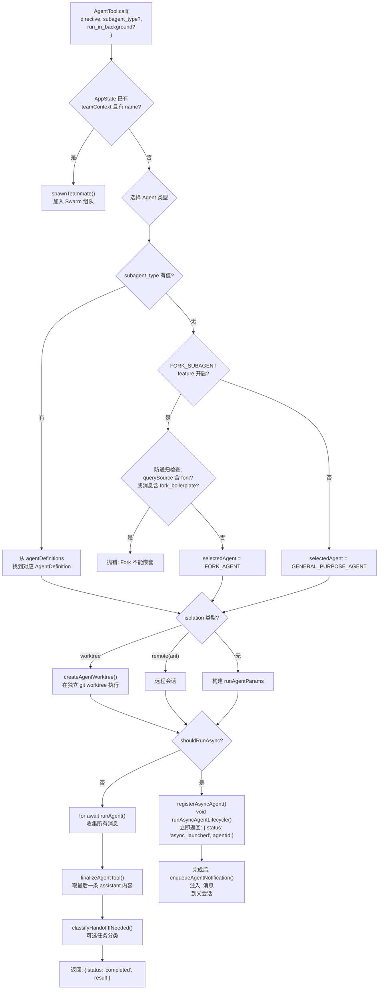
```mermaid
flowchart TD
    CALL["AgentTool.call(\n  directive, subagent_type?,\n  run_in_background?\n)"] --> SWARM{"AppState 已有\nteamContext 且有 name?"}

    SWARM -->|是| SPAWN_TEAMMATE["spawnTeammate()\n加入 Swarm 组队"]

    SWARM -->|否| SELECT{"选择 Agent 类型"}

    SELECT --> HAS_TYPE{"subagent_type 有值?"}
    HAS_TYPE -->|有| FIND["从 agentDefinitions\n找到对应 AgentDefinition"]
    HAS_TYPE -->|无| FORK_CHECK{"FORK_SUBAGENT\nfeature 开启?"}

    FORK_CHECK -->|是| FORK_GUARD{"防递归检查:\nquerySource 含 fork?\n或消息含 fork_boilerplate?"}
    FORK_GUARD -->|是| THROW["抛错: Fork 不能嵌套"]
    FORK_GUARD -->|否| USE_FORK["selectedAgent = FORK_AGENT"]

    FORK_CHECK -->|否| USE_GENERAL["selectedAgent = GENERAL_PURPOSE_AGENT"]

    FIND & USE_FORK & USE_GENERAL --> ISOLATION{"isolation 类型?"}

    ISOLATION -->|"worktree"| WORKTREE["createAgentWorktree()\n在独立 git worktree 执行"]
    ISOLATION -->|"remote(ant)"| REMOTE["远程会话"]
    ISOLATION -->|"无"| BUILD_PARAMS["构建 runAgentParams"]

    WORKTREE & REMOTE & BUILD_PARAMS --> ASYNC{"shouldRunAsync?"}

    ASYNC -->|是| ASYNC_PATH["registerAsyncAgent()\nvoid runAsyncAgentLifecycle()\n立即返回: { status: 'async_launched', agentId }"]

    ASYNC -->|否| SYNC_PATH["for await runAgent()\n收集所有消息"]

    SYNC_PATH --> FINALIZE["finalizeAgentTool()\n取最后一条 assistant 内容"]
    FINALIZE --> CLASSIFY["classifyHandoffIfNeeded()\n可选任务分类"]
    CLASSIFY --> RETURN["返回: { status: 'completed', result }"]

    ASYNC_PATH --> NOTIFY["完成后: enqueueAgentNotification()\n注入 <task-notification> 消息\n到父会话"]
```

### 8.3 Fork 子 Agent：Prompt Cache 优化的精髓

```mermaid
sequenceDiagram
    participant Parent as 父 Agent
    participant Fork1 as Fork 子 Agent 1
    participant Fork2 as Fork 子 Agent 2
    participant API as Anthropic API
    participant Cache as Prompt Cache

    Note over Parent: 父 Agent 的 assistant 消息包含 2 个 tool_use

    Parent->>Fork1: buildForkedMessages(directive_1, assistantMsg)
    Parent->>Fork2: buildForkedMessages(directive_2, assistantMsg)

    Note over Fork1: 消息历史 =<br/>[...父历史（原封不动）]<br/>+ [克隆的 assistant 消息]<br/>+ [user: 占位 tool_results + 子任务1指令]

    Note over Fork2: 消息历史 =<br/>[...父历史（原封不动）]  ← 完全相同!<br/>+ [克隆的 assistant 消息]  ← 完全相同!<br/>+ [user: 占位 tool_results + 子任务2指令]  ← 只有最后文本不同!

    Fork1->>API: 请求（system prompt = 父级渲染结果）
    API->>Cache: 查询前缀缓存
    Cache-->>API: MISS（第一次）
    API-->>Fork1: 响应（同时写入 cache）

    Fork2->>API: 请求（system prompt = 父级渲染结果）← 字节级相同！
    API->>Cache: 查询前缀缓存
    Cache-->>API: HIT ✅ （父历史 + assistant 消息前缀命中）
    API-->>Fork2: 响应（省去大量 input token 费用）

    Note over Cache: Cache key 取决于：<br/>system prompt 字节<br/>+ tools 列表字节<br/>+ messages 前缀字节<br/>三者与父级完全一致 → 命中
```

**Fork 的核心消息结构**：

```
Fork 子 Agent 看到的消息历史：

[...父 Agent 的全部历史...]
        ↓ 完全复用，最大化 cache 前缀

[克隆的触发 fork 的 assistant 消息]
  content: [
    { type: 'thinking', ... },
    { type: 'text', text: '我来把这个任务分成3个子任务...' },
    { type: 'tool_use', id: 'toolu_01', name: 'Agent', input: {...} },
    { type: 'tool_use', id: 'toolu_02', name: 'Agent', input: {...} }
  ]
        ↓ 两个子 Agent 看到的完全相同

[user 消息（只有这里不同）]
  content: [
    { type: 'tool_result', tool_use_id: 'toolu_01',
      content: 'Fork started — processing in background' },  ← 固定占位
    { type: 'tool_result', tool_use_id: 'toolu_02',
      content: 'Fork started — processing in background' },  ← 固定占位
    { type: 'text', text:
      '<fork_boilerplate>STOP. READ THIS FIRST.\n..规则说明..</fork_boilerplate>\n
       子任务1的具体指令'  ← 子 Agent 1 独有
    }
  ]
```

### 8.4 Swarm 组队协作机制

```mermaid
flowchart TD
    TEAM_CREATE["TeamCreateTool.call(\n  team_name: 'research-team'\n)"] --> WRITE_FILE["写入 TeamFile:\n~/.claude/teams/research-team/team.json\n{ leadAgentId, leadSessionId, members }"]

    WRITE_FILE --> SET_STATE["setAppState({ teamContext: {\n  teamName, teamFilePath,\n  leadAgentId, teammates\n}})"]

    SET_STATE --> SPAWN["spawnTeammate()\n为每个任务创建 teammate"]

    subgraph COMM["通信机制：文件 mailbox（非 WebSocket）"]
        SEND["SendMessageTool.call(\n  to: 'researcher-1',\n  message: '分析第3章'\n)"] --> WRITE_MSG["写入:\n~/.claude/teams/research-team/\n  inboxes/researcher-1.json"]

        WRITE_MSG --> POLL{"in-process 同进程?\n或跨进程?"}
        POLL -->|"in-process"| UI_Q["Leader UI 队列\n优先使用"]
        POLL -->|"跨进程"| FILE_POLL["文件轮询\n按配置间隔"]
    end

    subgraph MSG_TYPES["消息类型"]
        MT1["普通文本消息"]
        MT2["plan 审批请求"]
        MT3["shutdown 指令"]
        MT4["permission_request\n（权限同步）"]
    end
```

### 8.5 子 Agent 的 transcript 存储隔离

```mermaid
graph LR
    subgraph MAIN_SESSION["主会话 transcript"]
        M1["msg_1 (user)"]
        M2["msg_2 (assistant)"]
        M3["msg_3 (tool_result: Agent 的最终输出)"]
        M1 --> M2 --> M3
    end

    subgraph SUB_AGENT["子 Agent transcript（侧链）"]
        S1["sub_msg_1 (user: directive)"]
        S2["sub_msg_2 (assistant)"]
        S3["sub_msg_3 (tool_result)"]
        S4["sub_msg_4 (assistant: 最终回复)"]
        S1 --> S2 --> S3 --> S4
    end

    M2 -->|"fork/launch"| S1
    S4 -->|"finalizeAgentTool()\n取最后一条内容"| M3

    NOTE1["主会话:\n~/.claude/projects/<project>/<sessionId>.jsonl\nisSidechain: false"]
    NOTE2["子 Agent:\n~/.claude/projects/<project>/\n  subagents/<agentId>.jsonl\nisSidechain: true, agentId: xxx"]
```

---

## 9. 上下文压缩策略

### 9.1 Token 空间分配

```mermaid
graph LR
    CW["Context Window\n= 200,000 tokens"] --> USABLE

    subgraph USABLE["可用空间分配"]
        OUT["模型输出预留\n~20,000 tokens"]
        BUF["Autocompact 触发缓冲\n13,000 tokens\nAUTOCOMPACT_BUFFER_TOKENS"]
        WARN["警告缓冲区\n20,000 tokens\nWARNING_THRESHOLD_BUFFER_TOKENS"]
        ACT["实际可用对话内容\n~147,000 tokens"]
    end

    THRESHOLDS["关键阈值：\n▸ autocompact 触发: 187,000 tokens\n  (200k - 13k)\n▸ 警告展示: 167,000 tokens\n  (187k - 20k)\n▸ 硬阻塞（autocompact关闭）: 197,000 tokens\n  (200k - 3k, MANUAL_COMPACT_BUFFER)"]
```

### 9.2 五种压缩策略的触发顺序

```mermaid
flowchart TD
    MSGS["当前消息列表"] --> STEP1

    STEP1["Step 1: getMessagesAfterCompactBoundary\n找最后一个 compact boundary\n从该位置切片（丢弃更早历史）"] --> STEP2

    STEP2["Step 2: applyToolResultBudget\n压缩单个工具结果中过大的内容\n（如超长文件读取结果）"] --> STEP3

    STEP3["Step 3: HISTORY_SNIP\nsnipCompactIfNeeded()\n投影 snip 视图（发给 API 更短）\nREPL 滚动视图不变"] --> STEP4

    STEP4["Step 4: microcompact\nmicrocompactMessages()\n细粒度压缩（跨 turns 的重复内容等）"] --> STEP5

    STEP5["Step 5: CONTEXT_COLLAPSE\napplyCollapsesIfNeeded()\n折叠可折叠内容（如重复文件读取）"] --> STEP6

    STEP6{"tokens >\ncontext_window - 13000?"}

    STEP6 -->|否| DONE["发送给 API"]
    STEP6 -->|是| AUTOCOMPACT

    subgraph AUTOCOMPACT["Step 6: Autocompact（Proactive）"]
        AC1["确定压缩范围\n（保留最近 N 条消息）"]
        AC2["构造压缩请求:\nsystem: NO_TOOLS_PREAMBLE（禁止工具调用）\nuser: getCompactPrompt(instructions)"]
        AC3["调模型（通常更小的模型）\n输出结构化摘要:\n<analysis>...</analysis>\n<summary>\n  1. 任务目标\n  2. 已完成工作\n  ... 9个章节\n</summary>"]
        AC4["buildPostCompactMessages()\n= [boundary_marker]\n  + [summary_user_message]\n  + [messagesToKeep]\n  + [attachments, hookResults]"]
        AC1 --> AC2 --> AC3 --> AC4
    end

    AUTOCOMPACT --> DONE

    PTL_ERROR{"API 返回 PTL 错误\n(Prompt Too Long)?"}
    DONE --> PTL_ERROR
    PTL_ERROR -->|是| REACTIVE["Step 7: REACTIVE_COMPACT\n反应式压缩 → 重试请求"]
    PTL_ERROR -->|否| END["正常继续"]
```

### 9.3 Compact Boundary 数据结构

```mermaid
graph TB
    subgraph BEFORE["压缩前的消息列表"]
        B1["msg_1 (user)"]
        B2["msg_2 (assistant)"]
        B3["... 大量历史消息 ..."]
        B10["msg_10 (assistant)"]
    end

    subgraph AFTER["压缩后的消息列表（append-only，历史仍在磁盘）"]
        A1["CompactBoundaryMessage:\n{\n  type: 'system',\n  subtype: 'compact_boundary',\n  parentUuid: null,  ← 断开物理链\n  logicalParentUuid: msg_10.uuid,  ← 逻辑连接\n  compactMetadata: {\n    trigger: 'auto',\n    preTokens: 45000,\n    messagesSummarized: 10\n  }\n}"]
        A2["UserMessage (摘要):\n{\n  isCompactSummary: true,\n  isVisibleInTranscriptOnly: true,\n  content: '# Previous conversation summary\n  ## Task: ...\n  ## Completed: ...'\n}"]
        A3["近期保留的消息\nmessagesToKeep"]
        A4["新的 msg_11, msg_12 ..."]
        A1 --> A2 --> A3 --> A4
    end

    B10 -->|"logical parent\n逻辑父节点保留"| A1

    NOTE["REPL 中可以滚动查看完整历史\n（消息 append-only，历史都在磁盘）\n\nAPI 请求只发送 boundary 之后的内容"]
```

### 9.4 Token 计数：精确 + 估算混合

```mermaid
flowchart TD
    MSGS["messages 列表"] --> SCAN["从末尾向前扫描\n找最后一条有 API usage 的 assistant 消息"]

    SCAN --> FOUND{"找到?"}

    FOUND -->|是| EXACT["精确部分:\ninput_tokens + cache_read_input_tokens + output_tokens\n（API 返回的精确值）"]
    EXACT --> EST["估算部分:\nroughTokenCountEstimation(messages[i+1:])\n（该消息之后的增量，粗略估算）"]
    EST --> SUM["精确 + 估算 = 总 token 数"]

    FOUND -->|否| ALL_EST["全部估算:\nroughTokenCountEstimation(all messages)\n（整条链都没有 usage 信息）"]
```

---

## 10. 会话持久化与恢复

### 10.1 存储结构全景

```mermaid
graph TB
    subgraph CLAUDE_DIR["~/.claude/"]
        CLAUDE_JSON[".claude.json\n全局配置文件\nGlobalConfig + ProjectConfig 字典"]

        subgraph SETTINGS["settings/"]
            USER_SET["settings.json\n用户 Settings"]
        end

        subgraph PROJECTS["projects/<sanitized-path>/"]
            TRANSCRIPT["<sessionId>.jsonl\n会话 transcript（主链）\n每行一条 JSON 消息"]
            SIDECHAIN["subagents/<agentId>.jsonl\n子 Agent transcript（侧链）"]
        end

        subgraph FILE_HIST["file-history/<sessionId>/"]
            SNAP["<hash>@v1, @v2...\n文件快照，支持 undo"]
        end

        subgraph MEMORY["projects/<path>/memory/"]
            MEM_INDEX["MEMORY.md\n记忆索引文件"]
            MEM_FILES["<topic>.md\n主题记忆文件（带 frontmatter）"]
        end

        HISTORY_FILE["history.jsonl\nCtrl+R 历史\n（不是对话 transcript！）"]
    end
```

### 10.2 parentUuid 链与 compact 断链

```mermaid
graph LR
    subgraph NORMAL["正常消息链"]
        N1["msg_1\nuuid: aaa\nparentUuid: null"]
        N2["msg_2\nuuid: bbb\nparentUuid: aaa"]
        N3["msg_3\nuuid: ccc\nparentUuid: bbb"]
        N1 --> N2 --> N3
    end

    subgraph AFTER_COMPACT["Compact 后（断链 + 逻辑连接）"]
        C1["msg_3\nuuid: ccc\nparentUuid: bbb"]
        CB["compact_boundary\nuuid: ddd\nparentUuid: null  ← 断开物理链\nlogicalParentUuid: ccc  ← 逻辑父节点"]
        CS["summary_msg\nuuid: eee\nparentUuid: ddd"]
        C4["msg_4\nuuid: fff\nparentUuid: eee"]
        C1 -.->|"logicalParent"| CB
        CB --> CS --> C4
    end

    NOTE_PHYS["物理链断开:\n从 compact_boundary 向前的\nparentUuid 链不再有效\n→ 使 'getMessagesAfterCompactBoundary'\n定位 boundary 很高效"]
    NOTE_LOG["逻辑链保留:\nlogicalParentUuid 指向压缩前的最后一条\n→ UI 时间线展示正确\n→ resume 时可选追溯完整历史"]
```

### 10.3 会话 Resume 流程

```mermaid
flowchart TD
    START["claude --resume [sessionId | file]"] --> LOAD["loadConversationForResume()"]

    LOAD --> SOURCE{"恢复来源"}
    SOURCE -->|"--resume 指定 sessionId"| FIND["在 ~/.claude/projects/**/*.jsonl\n找到对应文件"]
    SOURCE -->|"--resume 指定文件路径"| DIRECT["直接读取 .jsonl 文件"]
    SOURCE -->|"--resume 无参数"| LATEST["读最近的会话文件"]

    FIND & DIRECT & LATEST --> READ["loadTranscriptFile()\n读取所有 JSONL 行"]

    READ --> CHAIN["buildConversationChain()\n从 leaf 沿 parentUuid 向上回溯\n重建有序消息列表"]

    CHAIN --> COMPACT{"存在 compact_boundary?"}
    COMPACT -->|是| TRIM["getMessagesAfterCompactBoundary()\n只保留 boundary 之后的消息\n（发给 API 的部分）"]
    COMPACT -->|否| FULL["使用完整消息列表"]

    TRIM & FULL --> RESTORE["恢复 QueryEngine 状态:\n- mutableMessages = 恢复的历史\n- fileStateCache = 空（需重读文件）\n- sessionId 不变"]

    RESTORE --> INTERRUPTED{"CLAUDE_CODE_RESUME_INTERRUPTED_TURN=1?\n且最后一条是未完成的 assistant?"}
    INTERRUPTED -->|是| RESUME_TURN["继续未完成的工具调用\ncreateUserMessage 补全"]
    INTERRUPTED -->|否| READY["就绪，等待用户输入"]
```

### 10.4 fileStateCache 与 fileHistory 的区别

```mermaid
graph TB
    subgraph FSC["fileStateCache（内存 LRU）"]
        FSC_PURPOSE["目的：避免同一会话内重复读文件"]
        FSC_STORE["存储：Map<normalizePath, FileState>"]
        FSC_DATA["FileState:\n{\n  content: string,  ← 完整文本\n  timestamp: number,  ← mtime\n  offset?: number,  ← 分页读\n  limit?: number,\n  isPartialView?: boolean\n}"]
        FSC_LIMIT["上限：~25MB 总大小，100 条"]
        FSC_INVALID["失效时机：\nFileEditTool/FileWriteTool 写入后\n主动 set 新内容"]
    end

    subgraph FH["fileHistory（磁盘快照）"]
        FH_PURPOSE["目的：提供 undo/rewind 和 diff 统计"]
        FH_STORE["存储：~/.claude/file-history/<sessionId>/"]
        FH_DATA["每次 Edit 前复制原文件:\n<hash>@v1, <hash>@v2..."]
        FH_DIFF["diffStats：\ndiff 库的 diffLines\n计算插入/删除行数"]
        FH_UNDO["支持回滚到任意版本"]
    end

    FSC_PURPOSE -.->|"不同！"| FH_PURPOSE
```

---

## 11. 权限体系

### 11.1 权限的三层结构

```mermaid
graph TB
    subgraph L3["第三层：PermissionMode（全局策略）"]
        PM1["default\n高风险操作需确认"]
        PM2["plan\n只读，不执行写操作"]
        PM3["acceptEdits\n自动接受文件编辑"]
        PM4["dontAsk\nask → deny 不弹窗"]
        PM5["bypassPermissions\n跳过所有检查（危险！）"]
        PM6["auto（内部）\nLLM 分类器自动判断"]
        PM7["bubble（内部）\n向上冒泡给父 Agent"]
    end

    subgraph L2["第二层：ToolPermissionContext（运行时上下文）"]
        TPC1["mode: PermissionMode"]
        TPC2["additionalWorkingDirectories\n扩展允许的工作目录"]
        TPC3["alwaysAllowRules\n（按来源分桶）"]
        TPC4["alwaysDenyRules"]
        TPC5["alwaysAskRules"]
        TPC6["规则来源分桶:\nuserSettings / projectSettings /\nsession / cliArg / policySettings"]
    end

    subgraph L1["第一层：单工具权限（tool.checkPermissions）"]
        W1["文件系统边界检查\n路径在 allWorkingDirectories 内?"]
        W2["工具特定规则\n（BashTool: AST + 语义 + 路径）"]
        W3["命令规则匹配\ngitignore 风格的 allow/deny/ask"]
    end

    L3 --> L2 --> L1
```

### 11.2 ask 在不同环境下的处理

```mermaid
flowchart TD
    PERM_RESULT["权限决策结果: ask"] --> ENV{"运行环境"}

    ENV -->|"本地 REPL"| DIALOG["Ink 弹出权限对话框\n\n选项:\n[允许一次]\n[总是允许（写入 settings）]\n[拒绝一次]\n[总是拒绝（写入 settings）]"]

    DIALOG --> PERSIST{"用户选择了\n'总是'?"}
    PERSIST -->|是| SAVE["applyPermissionUpdate()\n写入 ~/.claude/settings.json\n或 .claude/settings.local.json"]
    PERSIST -->|否| ONE_TIME["一次性决策\n不持久化"]

    ENV -->|"SDK / -p 模式"| DONTASK{"dontAsk 开启?"}
    DONTASK -->|是| AUTO_DENY["ask → deny\n不弹窗"]
    DONTASK -->|否| SDK_ERR["报错退出\n（非交互模式无法弹窗）"]

    ENV -->|"Bridge / CCR 远程"| WS_REQUEST["子进程发出 control_request:\n{\n  type: 'control_request',\n  request_id: 'req_001',\n  request: {\n    subtype: 'can_use_tool',\n    tool_name: 'Bash',\n    input: {...},\n    tool_use_id: 'toolu_01'\n  }\n}"]
    WS_REQUEST --> WS_RESPONSE["通过 WebSocket 传给用户界面\n用户确认后回:\n{\n  type: 'control_response',\n  request_id: 'req_001',\n  response: {\n    behavior: 'allow',\n    updatedInput: {...}\n  }\n}"]
```

### 11.3 规则的层叠与优先级

```mermaid
flowchart LR
    subgraph RULE_SOURCES["规则来源（后者覆盖前者）"]
        RS1["pluginSettings\n插件默认规则"]
        RS2["userSettings\n~/.claude/settings.json"]
        RS3["projectSettings\n.claude/settings.json"]
        RS4["localSettings\n.claude/settings.local.json"]
        RS5["flagSettings\n--allowedTools CLI 参数"]
        RS6["policySettings\n企业 MDM 策略（最高优先级）"]
        RS1 --> RS2 --> RS3 --> RS4 --> RS5 --> RS6
    end

    RS6 --> MERGE["mergeWith() 叠加合并"]
    MERGE --> FINAL["最终 SettingsJson"]
```

---

## 12. 扩展系统：Plugin / Skill / Hook

### 12.1 三种扩展方式对比

```mermaid
graph TB
    subgraph HOOK["Hook（最轻量）"]
        H1["配置在 settings.json\n无需代码"]
        H2["28 种事件\n（PreToolUse/PostToolUse/Stop 等）"]
        H3["类型：command/prompt/http/agent"]
        H4["可 allow/block/modify 工具执行"]
    end

    subgraph SKILL["Skill（中量级）"]
        S1[".claude/skills/<name>/SKILL.md\nMarkdown frontmatter 配置"]
        S2["添加 /斜杠命令"]
        S3["可限制工具集、指定模型\n可 fork 到独立子 Agent"]
        S4["frontmatter 内可嵌入 shell 命令\n（自动执行并注入 prompt）"]
    end

    subgraph PLUGIN["Plugin（完整扩展包）"]
        P1["plugin.json manifest"]
        P2["可包含: commands/agents/\nskills/hooks/mcpServers"]
        P3["可提供自定义 MCP 服务器"]
        P4["支持 userConfig 配置项\n（API key 等用户参数）"]
    end

    HOOK -.->|"能力增强"| SKILL
    SKILL -.->|"能力增强"| PLUGIN
```

### 12.2 Hook 系统详解

```mermaid
sequenceDiagram
    participant TExec as toolExecution.ts
    participant HookEngine as Hook 执行引擎
    participant HookImpl as Hook 实现

    Note over TExec: 工具执行前
    TExec->>HookEngine: runPreToolUseHooks(toolName, input)

    HookEngine->>HookEngine: 找到匹配 matcher 的 hooks

    alt type: 'command'
        HookEngine->>HookImpl: spawn(command), stdin=JSON(hookInput)
        HookImpl-->>HookEngine: stdout = JSON hookOutput
    else type: 'prompt'
        HookEngine->>HookImpl: 小模型推理，prompt=配置的prompt，args=hookInput JSON
        HookImpl-->>HookEngine: JSON 输出
    else type: 'http'
        HookEngine->>HookImpl: POST hookInput to URL
        HookImpl-->>HookEngine: response JSON
    else type: 'agent'
        HookEngine->>HookImpl: 启动子 Agent，传入 hookInput 作为上下文
        HookImpl-->>HookEngine: agent 输出
    end

    HookEngine-->>TExec: hookOutput { decision, hookSpecificOutput { permissionDecision, updatedInput } }

    Note over TExec: 工具执行后
    TExec->>HookEngine: runPostToolUseHooks(toolName, input, result)
    HookEngine-->>TExec: hookOutput { hookSpecificOutput { updatedMCPToolOutput } }
```

**Hook 配置示例**：

```json
// ~/.claude/settings.json
{
  "hooks": {
    "PreToolUse": [{
      "matcher": "Bash",
      "hooks": [{
        "type": "command",
        "command": "bash -c 'echo $CLAUDE_HOOK_INPUT >> /tmp/audit.log'"
      }]
    }],
    "PostToolUse": [{
      "matcher": "FileWrite",
      "hooks": [{
        "type": "command",
        "command": "prettier --write \"$(echo $CLAUDE_HOOK_INPUT | jq -r .file_path)\""
      }]
    }],
    "Stop": [{
      "hooks": [{
        "type": "prompt",
        "prompt": "分析这次对话，判断是否需要更新 CHANGELOG。如需更新输出 {\"decision\":\"update\"}，否则输出 {\"decision\":\"skip\"}"
      }]
    }]
  }
}
```

### 12.3 Skill 的加载链路

```mermaid
flowchart TB
    subgraph DISCOVER["Skill 发现（启动时）"]
        D1["initBundledSkills()\n加载内置技能:\nbatch/debug/remember/verify/loop/..."]
        D2["getSkillDirCommands(cwd)\n~/.claude/skills/<name>/SKILL.md\n<project>/.claude/skills/<name>/SKILL.md"]
        D3["loadPluginSkills()\n已安装插件的 skills/"]
        D4["getMcpSkillCommands()\nMCP Resource 生成的技能\n(loadedFrom: 'mcp')"]
        D1 & D2 & D3 & D4 --> MERGE["合并为 Command[] 列表"]
    end

    subgraph PARSE["SKILL.md 解析"]
        P1["parseSkillFrontmatterFields()"]
        P2["字段: name/description/allowed-tools\nargument-hint/when_to_use\nmodel/effort/context/paths/hooks"]
        P3["正文: 发给模型的 prompt\n可包含内联 bash shell 代码块"]
        P1 --> P2 & P3
    end

    subgraph EXEC["Skill 执行"]
        E1["用户输入 /skill-name args"]
        E2["processSlashCommand 路由"]
        E3["getPromptForCommand(args, ctx)\n替换变量: ${CLAUDE_SKILL_DIR}\n${CLAUDE_SESSION_ID}"]
        E4["executeShellCommandsInPrompt()\n执行 prompt 内的 bash 代码块\n输出注入到 prompt 中\n（MCP 来源的 skill 不执行 shell）"]
        E5["生成最终 prompt 发给模型\n可选 fork 到独立子 Agent"]
        E1 --> E2 --> E3 --> E4 --> E5
    end

    DISCOVER --> PARSE --> EXEC
```

---

## 13. MCP 集成

### 13.1 MCP 双向集成架构

```mermaid
graph TB
    subgraph AS_CLIENT["Claude Code 作为 MCP 客户端"]
        CC_CLIENT["Claude Code 进程"]
        MCP1["MCP Server 1\n（你的自定义服务器）"]
        MCP2["MCP Server 2\n（第三方服务）"]

        CC_CLIENT -->|"stdio/SSE\ntools/list + tools/call"| MCP1
        CC_CLIENT -->|"stdio/SSE\ntools/list + tools/call"| MCP2

        NOTE1["client.ts fetchToolsForClient():\n每个 MCP 工具展开为 Tool 对象\nname: 'mcp__server__tool'\n透明代理到 MCP JSON-RPC"]
    end

    subgraph AS_SERVER["Claude Code 作为 MCP 服务端"]
        CC_SERVER["claude mcp serve"]
        EXT["外部 MCP 客户端\n（其他 AI 应用）"]

        EXT -->|"stdio\ntools/list + tools/call"| CC_SERVER
        NOTE2["entrypoints/mcp.ts:\n暴露 getTools() 的全部内置工具\nmcpClients: []（不转发外部 MCP 工具）\n⚠️ TODO: 暴露已连接的外部 MCP 工具"]
    end
```

### 13.2 MCP 工具的动态展开

```mermaid
flowchart TD
    CONNECT["MCP 服务器连接建立"] --> LIST["client.tools.list()\n获取工具列表"]

    LIST --> EXPAND["fetchToolsForClient()\n将每个 MCP 工具展开为 Tool 对象"]

    subgraph EXPAND["动态生成的 Tool 对象"]
        E1["name: 'mcp__my-server__search'\n（带命名空间前缀）"]
        E2["inputSchema: 从 MCP 工具的\njsonSchema 转换"]
        E3["call(args):\n  callMCPToolWithUrlElicitationRetry({\n    client,\n    tool: 'search',\n    args\n  })"]
        E4["isMcp: true\nmcpInfo: { serverName, toolName }"]
    end

    EXPAND --> MERGE["uniqBy(name) 合并入工具池\n（内置工具优先）"]

    MERGE --> MODEL["模型调用: tool_use { name: 'mcp__my-server__search' }\n→ 透明代理到 MCP JSON-RPC\n→ 用户感知不到这是 MCP 工具"]
```

### 13.3 MCP Resource vs Tool

```mermaid
graph LR
    subgraph TOOL["MCP Tool"]
        T1["tools/list 发现"]
        T2["tools/call 执行"]
        T3["语义：可执行动作（有副作用）"]
        T4["在 Claude Code 中：\n动态展开为 Tool 对象\n模型直接调用"]
    end

    subgraph RESOURCE["MCP Resource"]
        R1["resources/list 发现"]
        R2["resources/read 读取"]
        R3["语义：被动数据（只读）"]
        R4["在 Claude Code 中：\n通过 ListMcpResourcesTool\n和 ReadMcpResourceTool\n手动读取"]
        R5["二进制大文件：\n落盘后返回文件路径"]
        R6["特殊用途：skill:// URI\n可注册为 Skill 命令\n(MCP_SKILLS feature)"]
    end
```

---

## 14. 配置系统

### 14.1 配置的六层叠加

```mermaid
flowchart LR
    subgraph LAYERS["优先级从低（左）到高（右）"]
        L1["pluginSettings\n插件默认配置"]
        L2["userSettings\n~/.claude/settings.json\n个人全局"]
        L3["projectSettings\n.claude/settings.json\n项目共享（可提交 git）"]
        L4["localSettings\n.claude/settings.local.json\n本地私密（不提交 git）"]
        L5["flagSettings\n命令行参数\n--model, --permission-mode"]
        L6["policySettings\n企业 MDM 策略\n（用户无法覆盖）"]
        L1 -->|"mergeWith()\n后者覆盖前者"| L2
        L2 -->|mergeWith| L3
        L3 -->|mergeWith| L4
        L4 -->|mergeWith| L5
        L5 -->|mergeWith| L6
    end

    L6 --> FINAL["最终 SettingsJson\n生效配置"]
```

### 14.2 重要环境变量

| 变量 | 作用 |
|------|------|
| `ANTHROPIC_API_KEY` | API 密钥 |
| `CLAUDE_CODE_API_BASE_URL` | 自定义 API 地址（代理、私有部署） |
| `CLAUDE_CODE_DISABLE_CLAUDE_MDS=1` | 完全禁用所有 CLAUDE.md |
| `CLAUDE_CODE_SIMPLE=1` | 等同 --bare（跳过大量功能） |
| `CLAUDE_CODE_MAX_OUTPUT_TOKENS` | 限制模型最大输出 |
| `CLAUDE_CODE_AUTO_COMPACT_WINDOW` | 覆盖自动压缩触发阈值 |
| `CLAUDE_CODE_BLOCKING_LIMIT_OVERRIDE` | 覆盖硬阻塞 token 阈值 |
| `CLAUDE_CODE_USE_BEDROCK=1` | 使用 AWS Bedrock |
| `CLAUDE_CODE_USE_VERTEX=1` | 使用 Google Vertex AI |
| `CLAUDE_CODE_EAGER_FLUSH=1` | 每轮强制 flush 到磁盘 |
| `CLAUDE_CODE_DISABLE_THINKING=1` | 禁用 extended thinking |
| `CLAUDE_CODE_UNATTENDED_RETRY=1` | 无人值守，持续重试 429/529 |
| `CLAUDE_CODE_PROFILE_STARTUP=1` | 写启动性能报告到磁盘 |
| `DISABLE_AUTO_COMPACT=1` | 禁用自动压缩（必须手动） |
| `CLAUDE_CODE_REMOTE=1` | 标记为远程 CCR 会话 |
| `CLAUDE_CODE_DISABLE_AUTO_MEMORY=1` | 禁用自动记忆功能 |

---

## 15. 二次开发指南

### 15.1 四种扩展方式的选择

```mermaid
quadrantChart
    title Extension Method: Complexity vs Power
    x-axis Low Complexity --> High Complexity
    y-axis Low Power --> High Power
    ENV and CLAUDE.md: [0.1, 0.2]
    Hook command: [0.25, 0.4]
    Skill: [0.3, 0.5]
    Custom Agent: [0.35, 0.6]
    MCP Server: [0.6, 0.8]
    Plugin package: [0.75, 0.95]
    Source code mod: [0.95, 1.0]
```

### 15.2 SDK 编程调用（-p 模式）

```bash
# 单次查询，输出最终结果
echo "分析 src/ 的代码复杂度" | claude -p --output-format json

# 流式 NDJSON（每行一个 SDKMessage）
echo "重构这个函数" | claude -p --output-format stream-json --verbose

# 解析流式输出的关键消息类型
echo "task" | claude -p --output-format stream-json --verbose | while IFS= read -r line; do
  TYPE=$(echo "$line" | jq -r '.type // empty')
  case $TYPE in
    "assistant")
      echo "$line" | jq -r '.message.content[].text // empty'
      ;;
    "result")
      echo "Cost: $(echo "$line" | jq -r '.cost_usd') USD"
      ;;
  esac
done
```

**SDKMessage 的主要类型**：

```mermaid
graph LR
    SDK["SDKMessage\n（25 种变体）"] --> CONV["对话类\nassistant: 模型文字/工具调用\nuser: tool_result 回传\nuser replay: 重放"]
    SDK --> RESULT["结果类\nresult/success: 会话成功\nresult/error_*: 各种错误"]
    SDK --> SYS["系统类\nsystem/init: 会话初始化\nsystem/compact_boundary: 压缩边界\nsystem/status: compacting状态\nsystem/api_retry: 重试通知\nsystem/task_notification: 子Agent完成"]
    SDK --> STREAM["流式类\nstream_event: 含 API 原始流事件\ntool_progress: 工具执行进度"]
    SDK --> OTHER["其他\nauth_status: 认证状态\nrate_limit_event: 限流事件\nprompt_suggestion: 提示建议"]
```

### 15.3 WebSocket SDK 控制（双向通信）

```mermaid
sequenceDiagram
    participant App as 你的应用
    participant WS as WebSocket Server
    participant Claude as claude --sdk-url

    App->>WS: 启动 WebSocket 服务器
    App->>Claude: claude --sdk-url ws://localhost:8080/session/123

    Claude->>WS: 连接

    App->>WS: 发送用户消息
    WS->>Claude: type=user, message={role:user, content:帮我写测试}

    Claude-->>WS: type=assistant, message={...} 流式
    WS-->>App: 转发消息

    Note over App,Claude: 当模型需要权限时
    Claude-->>WS: type=control_request, request_id=r1, subtype=can_use_tool, tool=Bash
    WS-->>App: 转发

    App->>WS: 用户决策
    WS->>Claude: type=control_response, request_id=r1, behavior=allow

    Note over App,Claude: 中断正在执行的任务
    App->>WS: type=control_request, request_id=r2, subtype=interrupt
    WS->>Claude: 转发
```

### 15.4 自定义 Agent 模板

```markdown
---
name: pr-reviewer
description: 当用户请求 PR 代码审查时使用。分析代码变更，提供结构化审查意见。
tools: ["Read", "Grep", "Glob", "Bash"]
disallowedTools: ["FileWrite", "FileEdit"]   # 审查不需要写权限
model: claude-opus-4-5
effort: high
permissionMode: default
maxTurns: 20
memory: project    # 在项目级记忆中保存审查标准
---

你是一个专业的代码审查专家。在审查 PR 时，请：

1. **检查逻辑正确性**：代码逻辑是否正确，边界情况是否处理
2. **识别安全问题**：是否存在注入、越权等安全风险
3. **评估代码质量**：可读性、维护性、性能
4. **提供具体建议**：每个问题都给出修改建议

输出格式：
## 总体评分：X/10
## 必须修改（阻塞合并）
- ...
## 建议改进（非阻塞）
- ...
## 亮点
- ...
```

### 15.5 自定义工具开发（修改源码）

```typescript
// src/tools/MyTool/MyTool.ts
import { buildTool } from '../../Tool.js'
import { z } from 'zod'

export const MyTool = buildTool({
  name: 'MyTool',

  // 工具说明：注入 system prompt
  async prompt(options) {
    return `## MyTool
用于 [描述工具的用途]。
Parameters:
- target: [说明]
Limitations: [重要限制]`
  },

  // 简短描述：用于 UI 展示和 ToolSearch
  async description(input, options) {
    return `处理 ${input.target}`
  },

  // 输入 schema（Zod，自动生成 JSON Schema 给 API）
  inputSchema: z.object({
    target: z.string().describe('处理目标'),
    options: z.object({
      verbose: z.boolean().default(false)
    }).optional()
  }),

  // 并发安全（只读操作可以设为 true）
  isConcurrencySafe: (input) => true,
  isReadOnly: (input) => true,

  // 权限检查（返回 allow/deny/ask）
  async checkPermissions(input, ctx) {
    // 检查路径是否在允许范围内
    const inWorkingDir = ctx?.getAppState().toolPermissionContext
      .additionalWorkingDirectories
      .some(dir => input.target.startsWith(dir))

    if (!inWorkingDir && !input.target.startsWith(process.cwd())) {
      return {
        behavior: 'ask',
        message: `访问 ${input.target} 需要确认`,
        // permission_suggestions: [...]  // 可提供建议规则
      }
    }
    return { behavior: 'allow', updatedInput: input }
  },

  // 核心执行逻辑
  async call(input, toolUseContext, canUseTool, parentMessage, onProgress) {
    // toolUseContext.abortController.signal  处理取消
    // toolUseContext.readFileState            文件缓存
    // toolUseContext.getAppState()            全局状态
    // toolUseContext.messages                 会话历史

    // 报告进度（会实时显示给用户）
    onProgress?.({ message: `正在处理 ${input.target}...` })

    const result = await doWork(input.target)

    return { data: result }
  },

  // 结果渲染
  renderToolUseMessage: (input) => <span>处理 {input.target}</span>,
  renderToolResultMessage: (result) => <div>{JSON.stringify(result)}</div>,
})

// 在 src/tools.ts 的 getAllBaseTools() 中注册
```

---

## 16. 关键文件速查

### 核心引擎

| 文件 | 行数 | 核心职责 |
|------|------|---------|
| `src/entrypoints/cli.tsx` | ~320 | 极速路径分发，11 种 fast-path |
| `src/main.tsx` | ~4600 | Commander 命令注册，所有模式分支，性能预热 |
| `src/entrypoints/init.ts` | ~340 | 19 步初始化副作用链 |
| `src/QueryEngine.ts` | ~1300 | 会话级编排器，submitMessage 主逻辑 |
| `src/query.ts` | ~1700 | queryLoop，5 种压缩，工具执行，stop hooks |
| `src/query/deps.ts` | ~30 | 依赖注入接口（便于测试） |
| `src/query/tokenBudget.ts` | ~120 | Token 预算与收益递减算法 |

### 上下文与记忆

| 文件 | 核心职责 |
|------|---------|
| `src/context.ts` | getGitStatus / getUserContext / getSystemContext |
| `src/utils/claudemd.ts` | CLAUDE.md 6 级优先级发现、加载、@include 处理 |
| `src/utils/queryContext.ts` | fetchSystemPromptParts，prompt 三层结构组装 |
| `src/services/compact/` | 五种压缩策略实现 |
| `src/memdir/` | 结构化记忆系统（MEMORY.md + LLM 检索） |

### 工具系统

| 文件 | 核心职责 |
|------|---------|
| `src/Tool.ts` | Tool 完整接口定义，buildTool 工厂函数 |
| `src/tools.ts` | 工具注册中心，getAllBaseTools / getTools |
| `src/services/tools/toolExecution.ts` | 工具执行管线（Zod → hooks → 权限 → call） |
| `src/services/tools/toolOrchestration.ts` | 并发分区，runTools |
| `src/services/tools/StreamingToolExecutor.ts` | 边流边执行 |
| `src/utils/bash/ast.ts` | Tree-sitter AST 安全语义分析 |
| `src/tools/BashTool/bashPermissions.ts` | Bash 权限决策树 |
| `src/tools/BashTool/pathValidation.ts` | 路径约束检查 |
| `src/tools/FileEditTool/utils.ts` | findActualString，引号对齐 |

### 多 Agent

| 文件 | 核心职责 |
|------|---------|
| `src/tools/AgentTool/AgentTool.tsx` | AgentTool 执行路径，类型选择，async/sync 分发 |
| `src/tools/AgentTool/runAgent.ts` | Agent 运行逻辑，system prompt 构建，transcript 隔离 |
| `src/tools/AgentTool/forkSubagent.ts` | Fork 机制，buildForkedMessages，cache 优化 |
| `src/tools/AgentTool/loadAgentsDir.ts` | Agent 定义加载（markdown frontmatter 解析） |
| `src/utils/swarm/` | Swarm 协作，mailbox 通信，teammate 管理 |

### 持久化

| 文件 | 核心职责 |
|------|---------|
| `src/utils/sessionStorage.ts` | JSONL 持久化，parentUuid 链管理 |
| `src/utils/conversationRecovery.ts` | 会话恢复（Resume） |
| `src/utils/fileStateCache.ts` | 文件内容 LRU 缓存（25MB，100条） |
| `src/utils/fileHistory.ts` | undo 快照，diff 统计 |
| `src/bootstrap/state.ts` | 全局会话状态（sessionId，cwd，originalCwd） |

### 扩展与 SDK

| 文件 | 核心职责 |
|------|---------|
| `src/entrypoints/sdk/coreSchemas.ts` | SDKMessage 25 种变体的 Zod schema |
| `src/entrypoints/sdk/controlSchemas.ts` | WebSocket 控制协议（control_request 子类型） |
| `src/cli/print.ts` | -p 打印模式实现 |
| `src/skills/loadSkillsDir.ts` | SKILL.md 加载与解析 |
| `src/utils/plugins/pluginLoader.ts` | Plugin 加载与 manifest 解析 |
| `src/utils/hooks/` | Hook 执行引擎（28 种事件） |
| `src/entrypoints/mcp.ts` | Claude Code 作为 MCP 服务端 |
| `src/services/mcp/client.ts` | MCP 客户端，工具动态展开 |

### 配置与状态

| 文件 | 核心职责 |
|------|---------|
| `src/utils/config.ts` | GlobalConfig / ProjectConfig 完整定义与读写 |
| `src/utils/settings/settings.ts` | SettingsJson 六层叠加合并 |
| `src/state/AppStateStore.ts` | AppState 类型定义（权限/任务/MCP/插件等） |
| `src/state/onChangeAppState.ts` | 状态变化副作用（同步 CCR，清 cache，写磁盘） |

---

## 附录：快速答疑

**Q：为什么有时候模型"忘记"了 CLAUDE.md 里的规则？**

可能原因：
1. 对话太长，CLAUDE.md 被压缩到摘要中，细节丢失
2. 使用了 `--bare` 模式或 `CLAUDE_CODE_DISABLE_CLAUDE_MDS=1`
3. CLAUDE.md 在 `.gitignore` 里或路径不正确
4. `claudeMdExcludes` 设置排除了该文件

**Q：如何让子 Agent 只能读不能写？**

```markdown
---
name: readonly-agent
tools: ["Read", "Grep", "Glob", "WebFetch", "WebSearch"]
disallowedTools: ["Bash", "FileWrite", "FileEdit", "NotebookEdit"]
permissionMode: default
---
```

**Q：如何实现"不打扰模式"（全自动，不弹权限窗口）？**

```bash
# 方式一：bypassPermissions（最宽松，危险！）
claude --permission-mode bypassPermissions

# 方式二：auto 模式（LLM 自动判断，较安全）
# 在 settings.json 中配置

# 方式三：预先配置 alwaysAllowRules
# 把常用操作加入 alwaysAllow，其他用 dontAsk → deny
claude --permission-mode dontAsk
```

**Q：如何调试 Token 使用量？**

```bash
# 开启 verbose 模式，会显示每轮的 token 统计
claude --verbose

# 查看历史会话的 token 统计
cat ~/.claude/projects/.../sessionId.jsonl | jq 'select(.message.usage) | .message.usage'
```

**Q：Fork 子 Agent 和普通子 Agent 分别适用什么场景？**

```
Fork 子 Agent：
  ✅ 当前任务可以拆分为多个"独立且相似"的子任务
  ✅ 父级上下文很长，希望复用 prompt cache
  ✅ 子任务不需要特殊的系统提示
  ❌ 不能嵌套 fork（fork 内不能再 fork）

普通子 Agent（指定 subagent_type）：
  ✅ 需要专门的角色/系统提示（如代码审查专家）
  ✅ 需要限定特定工具集
  ✅ 需要独立的记忆空间（memory: project）
  ✅ 可以嵌套调用（子 Agent 内还可以再派子 Agent）
```
